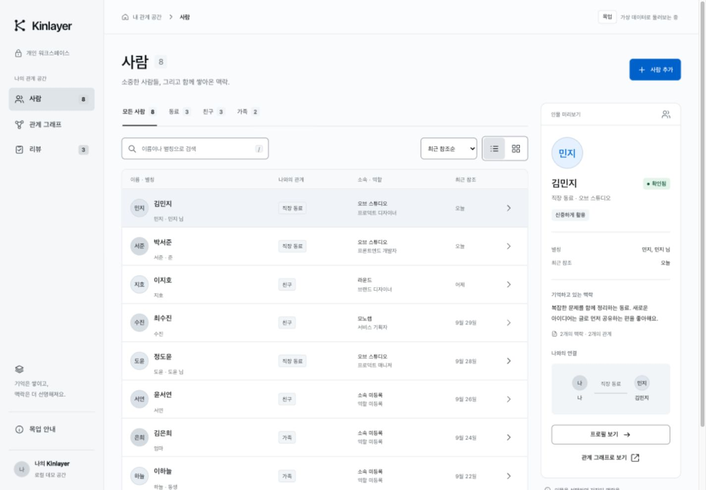
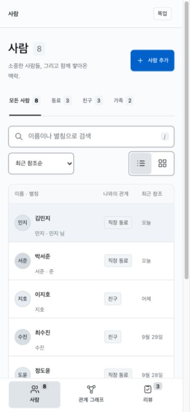
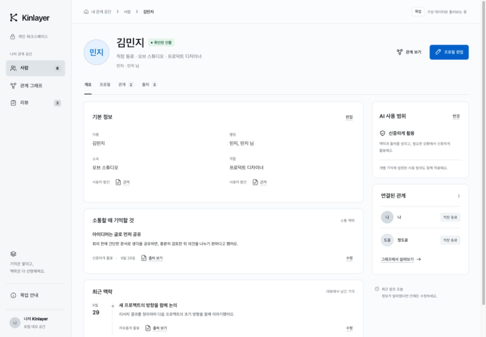
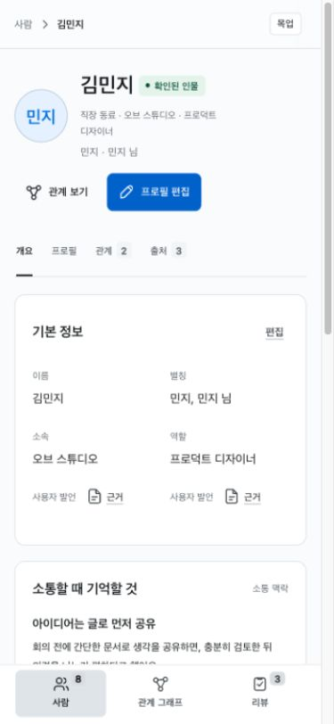
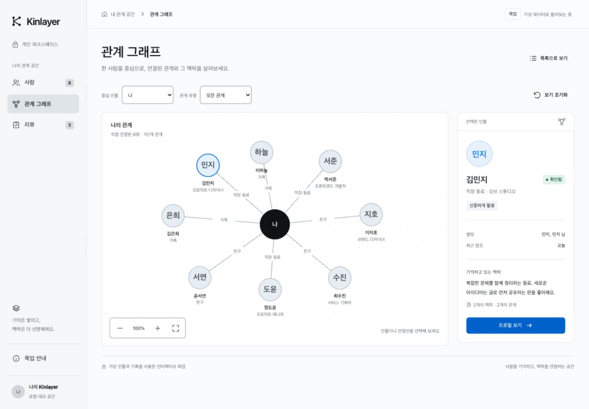
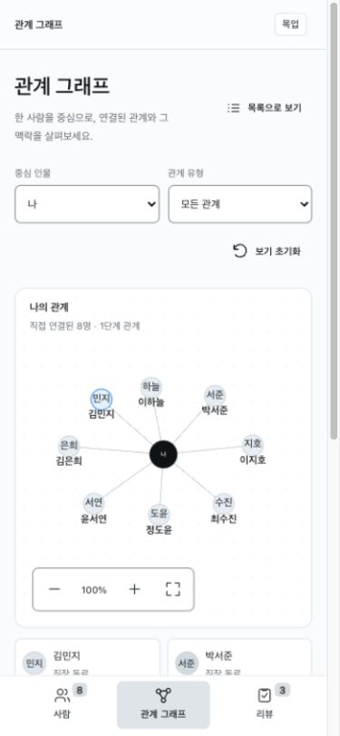
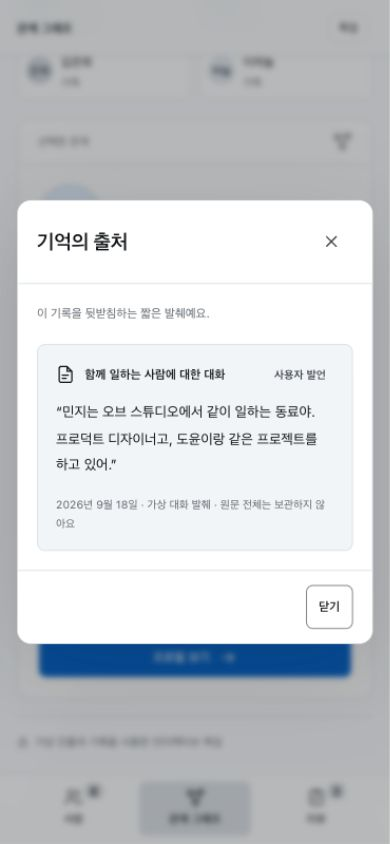
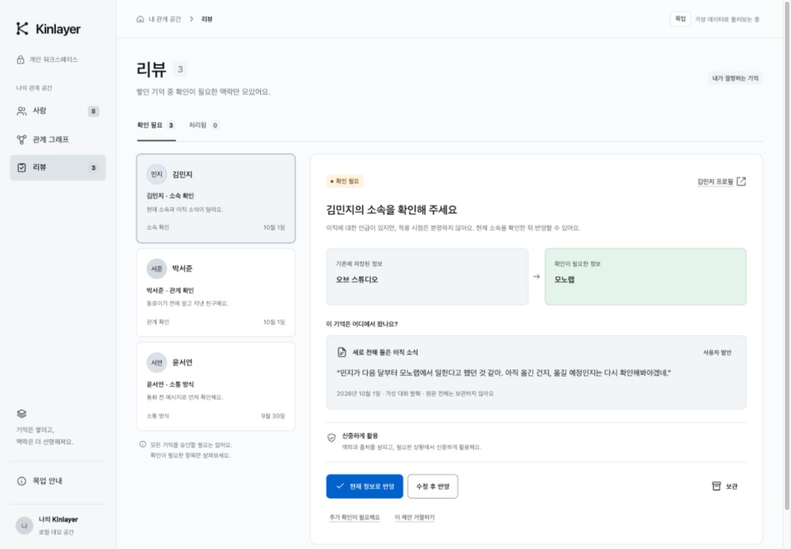
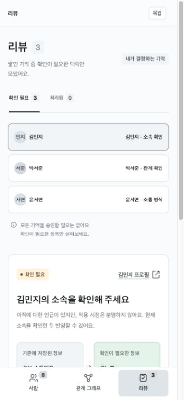

# frontend v2 목업 인수 평가 — 2026-10-01

## 판단

**현재 시각 디자인과 한국어 UI는 채택할 만하다. 다만 이 목업을 그대로 API에 연결해 기존 프론트엔드를 교체하면 안 된다.** 주요 행동이 현재의 즉시 저장·정정 계약보다 이전 정책·후보 승인 모델을 따른다. DB를 목업에 맞춰 바꾸기보다 목업의 데이터와 행동을 현 계약에 맞추는 것이 우선이다.

평가 기준은 최신 `origin/main`의 `cd020b8`, 실제 백엔드 모델·스키마·라우터·서비스, 현재 React 프론트엔드와 `docs/plans/frontend-rebuild.md`이다. 운영 API/DB 상태나 데이터는 이번 평가의 근거로 사용하지 않았다.

원본 목업 16개 파일을 바이트 비교 후 `codex/frontend-v2-audit` 작업 브랜치의 `frontend_v2`로 가져왔다. `46f8ed2`가 수정 전 원본이며 `import-manifest.json`에 원본 SHA-256을 남겼다. 원본 Open Design 폴더, 기존 `frontend/`, 기존 체크아웃의 변경사항은 보존했다. 이 폴더는 아직 가상 데이터/localStorage 시연이며 실제 API 연결·운영 전환·배포를 포함하지 않는다.

## 네 화면의 평가

| 순서 | 화면 | 시각·상호작용 상태 | 교체 전 필요한 변화 |
|---|---|---|---|
| 1 | 사람 목록 | 검색·관계 필터·정렬·카드/목록 전환이 명확하다. 모바일 행 탐색과 필터 후 미리보기 동기화를 수정했다. | 실제 페이지 전체를 대상으로 하는 필터·집계·최근 참조 정렬 계약 필요. |
| 2 | 인물 상세 | 기본 정보→소통 맥락→최근 맥락, 출처 접근이 읽기 쉽다. 잘못된 인물 링크, 좁은 편집창, 저장 후 포커스를 수정했다. | 정책 대신 근거·불확실성 표시, 개별 기록 참조, 철회·재귀속·이력 추가. |
| 3 | 관계 그래프 | 1단계 관계 중심은 제품 목적에 맞는다. 모바일 글자와 관계 선택·출처 접근, 선택 표시, 중앙 라벨 겹침, 드래그 배율을 수정했다. | 전체 ontology와 방향성 보존. 많은 노드·긴 이름에서는 별도 배치 전략 필요. |
| 4 | 리뷰 | 현재/제안 비교와 원문 발췌 배치는 재사용 가치가 있다. 반영·수정 후 반영·거절·보관·추가 확인 동작을 검사했다. | 저장 전 반영 대기 흐름을 저장된 기억 점검·변경 이력으로 전환. |

전체적으로 여백, 낮은 채도의 색, 표와 패널의 계층이 일관된다. 기본 본문과 보조 정보가 구분되고, 한국어 이름·별칭·출처가 내부 식별자보다 먼저 보인다. 시각 스타일을 다시 만드는 작업보다 정보 의미를 바로잡는 작업이 더 중요하다.

## 스키마·제품 계약 불일치와 제안

### 1. AI 사용 정책과 ‘확인됨’은 현재 의미가 없다 — 교체 차단

목업의 `freely_use`, `cautious_use`, `ask_before_use`, `never_surface` 편집은 실제 통제처럼 보인다. 그러나 현재 `schemas/common.py:46`은 호환 쓰기에서 정책/확인 상태를 제거하고, `services/ontology.py:59`는 이를 legacy로 분류한다. `schemas/context.py`도 current context에서 과거 정책 필드를 제외한다. ‘확인된 인물’ 배지는 목업에서 조건 없이 붙는다.

**제안:** 정책 편집과 배지를 제거하고 `claim_basis=reported/inferred/unknown`, 출처, 유효 시점을 표시한다. ‘전해 들은 내용’은 ‘사실로 검증됨’과 구분한다. 이번 시각 수정에서는 큰 제품 변경을 하지 않았으므로 기존 정책 시연이 남아 있다. 운영 기능으로 채택할 수 없다.

### 2. 리뷰가 새 기억의 저장 전 관문이다 — 교체 차단

리뷰에만 있는 새 소속·관계·소통 맥락은 반영 버튼을 눌러야 인물 기록이 된다. 현재 `api/system.py:38`은 `review_required=false`, `api/memories.py:19`는 즉시 저장 경로를 제공한다.

김민지 사례는 특히 위험하다. “다음 달부터 모노랩…했던 것 같아…다시 확인”이라는 발췌를 반영하면 목업은 현재 소속을 바로 모노랩으로 바꾼다. 미래 계획과 불확실성이 사라진다.

**제안:** 네 번째 화면의 비교·출처 구성을 **변경 이력/저장된 기억 점검**으로 바꾼다. 불확실한 이직 소식도 근거·시점과 함께 저장하고, 현재 소속을 확정한 것으로 표시하지 않는다. 옛 후보 기록은 진단/기록 메뉴에 별도로 둔다.

### 3. 객체 덮어쓰기는 기록별 정정 계약과 다르다 — 교체 차단

목업 fact에는 고유 기록 ID가 없고, type으로 첫 항목을 찾아 수정한다. `previous` 하나는 전체 변경 이력이 아니다. 철회와 다른 인물로 옮기기도 없다.

**제안:** 각 주장의 `record_type/id`, `updated_at`, 출처 참조를 보존하고 `/api/memories`의 `correct/retract/reattribute`를 사용한다. `request_id`, 정확한 `old_record_ref`, 사람 출처와 필요 시 `expected_updated_at`을 보낸다. 실패 시 초안을 보존하고 재시도는 같은 요청 ID를 쓴다. 기존 PATCH/DELETE를 그대로 연결하면 추적된 기억은 `memory_change_required` 409로 거절된다.

근거: `schemas/memories.py:103`, `services/memories.py:99`, `services/entity_guards.py:33`. 프로필의 이름·별칭·여러 사실을 한 번에 저장하는 화면은 여러 서버 작업의 부분 실패도 설명해야 한다.

### 4. 기억 종류·날짜·당사자 구분이 부족하다 — 교체 차단

목업은 소속/역할만 표시하고 소통 선호 이외의 관찰을 모두 ‘최근 맥락’으로 묶는다. 현재 스키마에는 생년월일/생일/연락처 등 typed fact, 안정 맥락, 주의사항, 감정, 후속 맥락이 있다. 누가 말했는지, 누가 느꼈는지, 누구에 관한 주장인지도 별도 역할이다.

**제안:** 개인 메모·선호·감정은 개별 observations로, 소속·역할은 개별 entity_facts로 매핑한다. 생일은 `year/month/day/precision`을 그대로 표시한다. 발화 시각, 사건 시각, 유효 기간을 분리하고 모르는 날짜를 만들지 않는다. 사실 종류와 역할은 `services/ontology.py:22`, `schemas/relationships.py:63`, `schemas/context.py:110`, `services/structured_facts.py:121`을 기준으로 한다. 소속을 조직 그래프 노드로 만들지 않은 방향은 현재 계약과 맞다.

### 5. 관계 6종과 양방향 표시만으로는 부족하다 — 교체 차단

목업의 6개 관계 값은 유효하지만 현 registry에는 20개가 있다. 보고 관계·소개 관계 등에는 방향이 있다. 모르는 유형을 ‘아는 사이’로 바꾸거나 항상 ↔로 표시하면 의미를 바꾼다.

**제안:** `/api/ontology`와 graph 응답의 `directed`를 사용한다. 미지원 유형은 원값을 보존한다. ‘나’는 실제 `system_role=self` 엔티티의 ID를 조회하며 데모 문자열 `self`를 그대로 API에 보내지 않는다. 근거: `services/ontology.py:65`, `schemas/graph.py:12`.

### 6. 읽기 API 보완과 기존 기능 보존이 필요하다

| 화면 목적 | 재사용 가능한 현재 API | 남은 작업 |
|---|---|---|
| 사람/별칭 | `/api/entities`, `/api/entities/{id}/context-card` | 관계 필터·최근 참조 정렬·전체 집계. 첫 페이지만 가져와 전체 결과처럼 표시하면 안 됨. |
| 기억 | `/api/entity-facts`, `/api/edges`, `/api/observations` 및 각 상세 | 종류를 가로지르는 페이지네이션·검색·basis 필터. |
| 출처 | `/api/episodes/{id}`, context provenance | 출처→전체 연결 기억 역조회, 과거 기록의 증거 조회. |
| 변경 | `/api/memory-changes?record_ref=&limit=&offset=` | 사람별 모든 기록을 묶은 전체 변경 이력. |
| 관계 | `/api/graph/ego/{id}?depth=1` | 방향·유형·상태의 의미 보존. |
| 검색·운영 | context retrieve/pack, system health/config, embeddings status | 기존 설정·검색 점검을 새 UI에 유지. |

`ProvenanceItem.record_type=fact/edge/observation`과 정정 ref의 `entity_facts/entity_edges/observations`는 명시적으로 변환해야 한다. 기존 frontend 타입에는 새 basis/출처 메타데이터가 빠져 있으므로 그대로 복사하지 말고 현재 백엔드 OpenAPI와 맞춘다.

기존 설정의 API/token 연결·서버 상태·embedding 상태, 검색 점검, Agent Write Operations 조회/내보내기, 과거 후보 이력 접근도 교체 범위에 포함해야 한다. 기존 화면에 남은 정책·승인 기능을 보존하자는 뜻은 아니다.

## 이번에 수정한 표시·상호작용 문제

- 모바일/좁은 화면에서 사람 행을 누르면 상세로 이동. 데스크톱 행 선택은 미리보기를 유지하며 키보드 포커스 보존.
- 필터·검색과 미리보기의 대상 동기화. 결과가 없으면 다른 인물을 계속 보여 주지 않음. 새 인물 추가 시 검색/필터를 초기화해 추가 결과 노출.
- 존재하지 않는 인물·빈 ID·self 상세 주소가 김민지로 대체되지 않도록 오류 화면 제공. 초기화로 인물이 사라진 경우도 처리.
- 1030px 이하에서 숨겨졌던 관계의 근거와 출처 열기 복원. 모바일 목록에 관계 유형·선택 상태를 표시하고 관계별 선택 지원.
- 모바일 그래프 이름 확대, 관계 유형은 읽을 수 있는 목록으로 제공. 중앙 인물의 중복 라벨 겹침 제거와 관계 선택선 강조.
- 320px 그래프 필터 글자가 잘리지 않도록 줄바꿈. SVG 비율에 맞게 드래그 좌표 변환.
- 편집창 헤더·저장/취소 버튼 고정, 배경 스크롤 잠금, 닫은 뒤 포커스 복원. 좁은 경로 표시와 긴 이름·소속 줄바꿈, 모바일 입력 크기 및 safe-area 여백 보완.

## 검증과 한계

- Codex 인앱 Chromium 브라우저에서 네 화면을 직접 조작하고 캡처했다.
- 네 화면 × 1440/768/390/320px 너비 모두 문서 가로 넘침 없음. 수치는 `evidence/viewport-checks.json`에 기록했다.
- 검색 빈 결과, 필터·카드, 필수값 오류, 긴 한국어 인물 추가·상세, 편집 저장·포커스, 잘못된 주소, 그래프 중심/필터/확대/초기화/드래그/출처, 리뷰 수정 반영→프로필→출처, 데모 초기화를 실제 브라우저에서 확인했다.
- 새 `interaction-checks.cjs`의 DOM/이벤트/localStorage 회귀 28개 통과. 원본의 24개 검사 코드는 전달되지 않아 새로 작성한 검사이며, 동일한 24개를 재실행했다고 주장하지 않는다.
- JS 구문과 CSS 파싱, diff 공백 검사 통과. 이번 코드 변경은 `frontend_v2`에 한정된다.
- 모바일은 브라우저 뷰포트 검증이다. 실제 iOS/Android 터치·가상 키보드, VoiceOver 전체 동선, WCAG 적합성 인증은 수행하지 않았다.
- API 미연결이므로 서버 오류·동시 정정·인증·대규모 데이터·실데이터 전환은 이번 완료 범위가 아니다. 현재 스키마와 맞지 않는 정책/리뷰 흐름은 앞의 제안대로 후속 설계가 필요하다.

## 최종 화면 증거

각 이미지는 이번 검증에서 저장한 실제 화면이다. 앞의 1–4 단계 순서와 대응한다.

### 1. 사람 목록 — 수정 후 정상

### 2. 인물 상세 — 표시/편집 정상, 데이터 계약 전환 필요

### 3. 관계 그래프 — 모바일 출처 접근 수정 완료

### 4. 리뷰 — 조작 정상, 역할 재설계 필요

## 권장 다음 단계

시각 토큰과 한국어 문구를 유지한 채 **사람 → 개별 기억 → 출처 → 변경 이력** 흐름으로 목업을 먼저 정렬한다. 그래프는 보조 뷰로, 설정·검색·기존 감사 기록은 보조 메뉴로 유지한다. 그 다음 API 읽기 공백을 보완하고 타입/API 계층을 만든 뒤 기존 React 프론트엔드를 교체한다.
