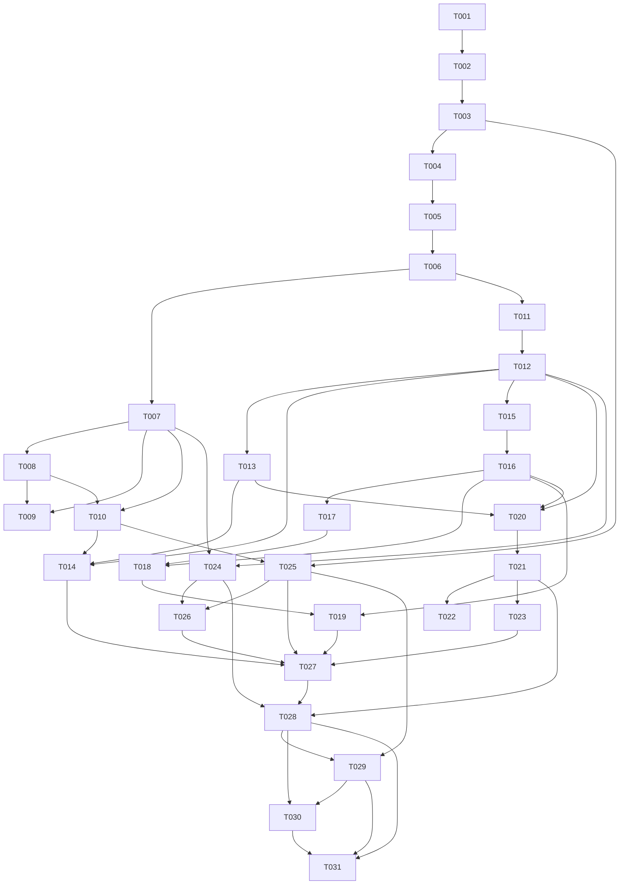

# Kinlayer MVP Implementation Plan

> **For agentic workers:** REQUIRED SUB-SKILL: Use `superpowers:subagent-driven-development` (recommended) or `superpowers:executing-plans` to implement this plan task-by-task. Track progress by updating each task's `Status` and checking off Acceptance Criteria.

**Goal:** Build the complete Kinlayer MVP: a local-first, single-user relationship context layer for AI agents with canonical HTTP API, CLI, Web control plane, provenance, candidates, corrections, policy-aware context packaging, graph view, and embedding-backed retrieval.

**Architecture:** Postgres is the canonical store for relationship context, provenance, candidate review, ontology registries, fuzzy search, and vector search. FastAPI owns all state-changing capabilities; the Typer CLI and React/Vite Web UI are clients of the same API. Implementation proceeds through task-sized vertical slices so each stage leaves the app runnable.

**Tech Stack:** Python 3.11+, FastAPI, SQLAlchemy 2.x, Alembic, Pydantic, Typer, httpx, sentence-transformers, Postgres 16 with `pgvector` and `pg_trgm`, React, Vite, TypeScript, React Flow, Docker Compose.

---

## Tracking Rules

Status values:

- `Backlog`: not ready because dependencies remain.
- `Ready`: dependencies are satisfied and the task can start.
- `In Progress`: actively being implemented.
- `Blocked`: cannot proceed without a decision or external state change.
- `Done`: implementation and acceptance criteria are verified.

Priority values:

- `Critical`: required for core MVP correctness or blocks many tasks.
- `High`: required for MVP user/agent workflows.
- `Medium`: important for complete UX, hardening, or maintainability.
- `Low`: useful polish or future-friendly cleanup.

Global rules:

- HTTP API is canonical. No Web-only state-changing capability.
- MVP is single-user and local-first. Do not add users, sessions, organizations, workspaces, billing, cloud sync, or multi-user auth.
- Optional `KINLAYER_API_TOKEN` protects every endpoint except `GET /api/system/health` and `GET /api/system/version`.
- Store bounded episode excerpts and hashes only. Do not store full raw conversation bodies.
- AI-inferred context enters `candidates`; explicit user corrections in agent conversation use direct correction apply.
- Edges represent structural relationships only. Feelings, cautions, patterns, strategy, and recent interactions are observations.
- Default deletes are soft delete, deprecate, archive, or supersede semantics. Protected self cannot be deleted.
- Context APIs retrieve, score, filter, and package context. They do not generate final advice, message drafts, or natural-language briefings.
- Before Docker operations, inspect current bindings and avoid honcho ports `8000`, `6379`, and `5432`.
- Do not commit or push unless explicitly asked.

---

## File Responsibility Map

Backend target structure:

- `backend/src/kinlayer_backend/models.py`: SQLAlchemy models and table relationships.
- `backend/src/kinlayer_backend/schemas/`: Pydantic request/response models grouped by API domain.
- `backend/src/kinlayer_backend/repositories/`: DB access helpers for entities, observations, candidates, retrieval, and graph queries.
- `backend/src/kinlayer_backend/services/`: domain behavior for ontology seed validation, self bootstrap, candidate resolution, corrections, embeddings, retrieval scoring, policy bucketing, and context cards.
- `backend/src/kinlayer_backend/api/`: FastAPI routers for system, entities, aliases, entity facts, edges, observations, episodes, candidates, corrections, context, graph, ontology, and embeddings.
- `backend/src/kinlayer_backend/cli.py`: Typer commands that call or mirror API contracts.
- `backend/alembic/versions/`: schema migrations.
- `backend/tests/`: API/service/CLI tests and smoke fixtures.

Frontend target structure:

- `frontend/src/api/`: typed API client, auth token handling, and shared error handling.
- `frontend/src/routes/`: screen components for `/people`, `/people/new`, `/people/:id`, `/candidates`, `/graph`, `/retrieval-debug`, `/settings`.
- `frontend/src/components/`: reusable forms, tables, policy badges, evidence panels, context sections, and graph detail panels.
- `frontend/src/types/`: API response/request TypeScript types.
- `frontend/src/App.tsx`: route shell only.

Scripts and docs:

- `scripts/`: smoke scripts for local API/CLI/Web acceptance checks.
- `README.md`: current runbook and verification commands.
- `acceptance-scenarios.md`: journey-level exit bar; add fixture-level examples only when behavior stabilizes.

---

## Task Index

| Task | Title | Priority | Status | Depends on |
| --- | --- | --- | --- | --- |
| T001 | Repository baseline and ground rules | Critical | Done | None |
| T002 | Docker, API, Web scaffold | Critical | Done | T001 |
| T003 | System API, config, and CLI baseline | Critical | Done | T002 |
| T004 | Quality and smoke-test baseline | High | Ready | T001, T002, T003 |
| T005 | Backend architecture split | High | Backlog | T004 |
| T006 | Core entity and ontology schema | Critical | Backlog | T005 |
| T007 | Entity, alias, and fact API | Critical | Backlog | T006 |
| T008 | Protected self bootstrap | Critical | Backlog | T006, T007 |
| T009 | People CLI commands | High | Backlog | T007, T008 |
| T010 | People Web bootstrap screens | High | Backlog | T007, T008 |
| T011 | Relationship, observation, episode, evidence schema | Critical | Backlog | T006 |
| T012 | Edge, observation, and episode API | Critical | Backlog | T011 |
| T013 | Embedding provider, status, and backfill | Critical | Backlog | T011, T012 |
| T014 | Person detail relationship/evidence UI | High | Backlog | T010, T012, T013 |
| T015 | Candidate schema and payload validation | Critical | Backlog | T012 |
| T016 | Candidate lifecycle API and canonical writes | Critical | Backlog | T015 |
| T017 | Explicit correction apply API | Critical | Backlog | T012, T016 |
| T018 | Candidate and correction CLI | High | Backlog | T016, T017 |
| T019 | Candidate inbox Web UI | High | Backlog | T016, T018 |
| T020 | Retrieval scoring and policy engine | Critical | Backlog | T012, T013, T016 |
| T021 | Context retrieve, pack, and context-card API | Critical | Backlog | T020 |
| T022 | Retrieval and context CLI | High | Backlog | T021 |
| T023 | Retrieval debug Web UI | High | Backlog | T021 |
| T024 | Graph and ontology read API | High | Backlog | T007, T012 |
| T025 | Web API client, routing, and settings | High | Backlog | T003, T010 |
| T026 | Ego graph Web UI | Medium | Backlog | T024, T025 |
| T027 | Full Web control-plane integration | High | Backlog | T014, T019, T023, T025, T026 |
| T028 | Acceptance fixtures and smoke scripts | High | Backlog | T021, T024, T027 |
| T029 | Optional token end-to-end hardening | High | Backlog | T025, T028 |
| T030 | README and specification consistency pass | Medium | Backlog | T028, T029 |
| T031 | MVP exit verification | Critical | Backlog | T028, T029, T030 |

---

## Completed Baseline

#### Task T001. Repository baseline and ground rules
- Priority: Critical
- Status: Done
- Depends on: None
- Acceptance Criteria:
  - [x] Git repository is initialized in `/Users/gyurin/dev/kinlayer`.
  - [x] `AGENTS.md` defines Kinlayer-local ground rules.
  - [x] `.gitignore` excludes Python, frontend, build, cache, and local env artifacts.
  - [x] `.dockerignore` files reduce Docker build context noise.
  - [x] `README.md` lists local defaults and basic run commands.
- Notes:
  - Default ports are API `8765`, Web `5173`, Postgres host `15432`.
  - No commit has been made yet.

#### Task T002. Docker, API, Web scaffold
- Priority: Critical
- Status: Done
- Depends on: T001
- Acceptance Criteria:
  - [x] `docker-compose.yml` defines Postgres, API, and Web services.
  - [x] Postgres uses a pgvector-capable image and exposes host port `127.0.0.1:15432`.
  - [x] API exposes host port `127.0.0.1:8765`.
  - [x] Web exposes host port `127.0.0.1:5173`.
  - [x] Docker startup was verified without conflicting with honcho `8000`, `6379`, or `5432`.
  - [x] Frontend app shell renders through the Codex in-app browser.
- Notes:
  - Current containers may already be running locally: `kinlayer-postgres`, `kinlayer-api`, `kinlayer-web`.

#### Task T003. System API, config, and CLI baseline
- Priority: Critical
- Status: Done
- Depends on: T002
- Acceptance Criteria:
  - [x] `GET /api/system/health` returns health, database, and embedding status.
  - [x] `GET /api/system/version` returns name, version, and API version.
  - [x] `GET /api/system/config` returns non-secret effective config.
  - [x] Optional bearer token middleware protects config while leaving health/version public.
  - [x] `kinlayer status --json` reads API health.
  - [x] Alembic initial migration enables `vector` and `pg_trgm`.
- Notes:
  - The baseline was verified with `uv run ruff check .`, Python import check, `npm run build`, `docker compose up -d --build`, `curl`, Alembic, CLI status, and browser rendering.

---

## Scaffold Hardening

#### Task T004. Quality and smoke-test baseline
- Priority: High
- Status: Ready
- Depends on: T001, T002, T003
- Acceptance Criteria:
  - [ ] Backend test dependencies are added to `pyproject.toml`.
  - [ ] `backend/tests/` contains system endpoint and optional token tests.
  - [ ] CLI smoke coverage verifies `kinlayer status --json`.
  - [ ] `scripts/smoke-slice0.sh` runs Docker port inspection, compose startup, Alembic, API health, CLI status, and frontend build.
  - [ ] `README.md` lists the exact local verification commands.
  - [ ] `uv run ruff check .`, `uv run pytest`, and `cd frontend && npm run build` pass locally.
- Notes:
  - This task deliberately adds tests after the scaffold baseline because the initial scaffold was created without test files by user request.

#### Task T005. Backend architecture split
- Priority: High
- Status: Backlog
- Depends on: T004
- Acceptance Criteria:
  - [ ] `backend/src/kinlayer_backend/api/` contains routers separated by API domain.
  - [ ] `backend/src/kinlayer_backend/schemas/` contains shared and domain-specific Pydantic schemas.
  - [ ] `backend/src/kinlayer_backend/repositories/` contains DB access boundaries.
  - [ ] `backend/src/kinlayer_backend/services/` contains domain behavior boundaries.
  - [ ] `main.py` registers routers without holding domain logic.
  - [ ] Existing system API and CLI behavior still pass the T004 smoke checks.
- Notes:
  - Keep the split small and concrete. Do not create abstraction layers that are not used by Slice 1.

---

## Core Entity Bootstrap

#### Task T006. Core entity and ontology schema
- Priority: Critical
- Status: Backlog
- Depends on: T005
- Acceptance Criteria:
  - [ ] SQLAlchemy models exist for `entities`, `entity_aliases`, `entity_facts`, and required ontology registry tables.
  - [ ] Alembic migration creates those tables from an empty DB.
  - [ ] Migration preserves the existing `vector` and `pg_trgm` extension setup.
  - [ ] Registry seed values exist for entity types, fact types, claim types, sensitivity levels, and AI use policies.
  - [ ] `entity_facts.fact_type` is validated against registry-backed seed/config values.
  - [ ] Model indexes include entity type, canonical name, confirmation status, protected self uniqueness, alias normalized name, and trgm search where applicable.
- Notes:
  - Use latest PRD/API decisions over stale `data-model.md` open questions: fact types are registry-backed, and `canonical_record_ref` remains string-based later.

#### Task T007. Entity, alias, and fact API
- Priority: Critical
- Status: Backlog
- Depends on: T006
- Acceptance Criteria:
  - [ ] Entity endpoints implement create/list/get/patch/delete under `/api/entities`.
  - [ ] Alias endpoints implement create/list/patch/delete under `/api/entities/{id}/aliases` and `/api/aliases/{id}`.
  - [ ] Entity fact endpoints implement create/list/get/patch/delete under `/api/entity-facts`.
  - [ ] List endpoints return `{items, limit, offset, total}`.
  - [ ] Controlled values return `validation_error` using the common API error shape.
  - [ ] DELETE operations apply soft-delete/deprecated semantics, not physical purge.
  - [ ] Optional bearer token protection applies to every new endpoint.
- Notes:
  - API behavior must follow `api-spec.md` and keep Web/CLI as clients.

#### Task T008. Protected self bootstrap
- Priority: Critical
- Status: Backlog
- Depends on: T006, T007
- Acceptance Criteria:
  - [ ] `kinlayer init` creates or confirms one protected self entity.
  - [ ] Self entity has `entity_type = person`, `system_role = self`, and `is_system = true`.
  - [ ] Re-running init is idempotent and does not create duplicate self rows.
  - [ ] Protected self cannot be deleted through `DELETE /api/entities/{id}`.
  - [ ] Protected self cannot lose system role through `PATCH /api/entities/{id}`.
  - [ ] Tests cover duplicate prevention and forbidden mutation cases.
- Notes:
  - Self relationships are represented as normal edges in later tasks.

#### Task T009. People CLI commands
- Priority: High
- Status: Backlog
- Depends on: T007, T008
- Acceptance Criteria:
  - [ ] `kinlayer person create --name ...` creates a person through API-compatible behavior.
  - [ ] `kinlayer person create` supports repeatable `--alias`.
  - [ ] `kinlayer person create` supports `--note`, `--sensitivity`, `--ai-use-policy`, and `--json`.
  - [ ] `kinlayer person list --query ... --json` returns API-backed search results.
  - [ ] `kinlayer person show <entity_id> --json` returns entity details, aliases, and facts.
  - [ ] CLI errors are readable in human mode and machine-readable in JSON mode.
- Notes:
  - CLI must not diverge from API validation or token behavior.

#### Task T010. People Web bootstrap screens
- Priority: High
- Status: Backlog
- Depends on: T007, T008
- Acceptance Criteria:
  - [ ] `/people` lists people from the API.
  - [ ] `/people` supports API-backed name/alias search.
  - [ ] `/people/new` creates a person with aliases, sensitivity, AI use policy, short note, and profile fact fields.
  - [ ] `/people/new` redirects to `/people/:id` after successful creation.
  - [ ] `/people/:id` shows entity summary, aliases, and profile facts.
  - [ ] Browser verification confirms all three routes load without console errors.
- Notes:
  - Keep UI operational and compact. Do not build a CRM-style dashboard.

---

## Relationships, Observations, Provenance, and Embeddings

#### Task T011. Relationship, observation, episode, evidence schema
- Priority: Critical
- Status: Backlog
- Depends on: T006
- Acceptance Criteria:
  - [ ] SQLAlchemy models and migration exist for `entity_edges`, `observations`, `observation_entities`, and `episodes`.
  - [ ] SQLAlchemy models and migration exist for `entity_fact_evidence`, `edge_evidence`, and `observation_evidence`.
  - [ ] Registry seed values exist for edge types, observation types, retention policies, and evidence-related controlled values.
  - [ ] Observation model includes embedding status fields and pgvector column.
  - [ ] Foreign keys preserve evidence integrity.
  - [ ] Migration succeeds on both empty DB and DB containing Slice 1 data.
- Notes:
  - Do not add full raw episode body storage.

#### Task T012. Edge, observation, and episode API
- Priority: Critical
- Status: Backlog
- Depends on: T011
- Acceptance Criteria:
  - [ ] Edge endpoints implement create/list/get/patch/delete under `/api/edges`.
  - [ ] Observation endpoints implement create/list/get/patch/delete under `/api/observations`.
  - [ ] Episode endpoints implement create/list/get under `/api/episodes`.
  - [ ] Edge validation requires registry-backed structural `relation_type`.
  - [ ] Observation related entities are stored through `observation_entities`.
  - [ ] Episode responses expose metadata, bounded excerpt, and hash only.
  - [ ] Edge and observation DELETE operations set deleted/deprecated status and `valid_to` where applicable.
- Notes:
  - Ambiguous advisory or emotional content should become an observation, not an edge.

#### Task T013. Embedding provider, status, and backfill
- Priority: Critical
- Status: Backlog
- Depends on: T011, T012
- Acceptance Criteria:
  - [ ] Embedding service supports disabled provider for local scaffold.
  - [ ] OpenAI-compatible provider works through `httpx` and env/config values.
  - [ ] Local sentence-transformers provider supports `dragonkue/multilingual-e5-small-ko-v2` and optional `nlpai-lab/KURE-v1`.
  - [ ] Observation create/update attempts synchronous embedding generation.
  - [ ] Embedding failure still saves the observation with `pending` or `failed` status.
  - [ ] `GET /api/embeddings/status` returns provider/model/dim/status and observation counts.
  - [ ] `POST /api/embeddings/backfill` processes pending/failed/stale observations.
  - [ ] `kinlayer embedding status` and `kinlayer embedding backfill` work.
- Notes:
  - MVP semantic retrieval is required; embedding can fail gracefully but must not be omitted from the design.

#### Task T014. Person detail relationship/evidence UI
- Priority: High
- Status: Backlog
- Depends on: T010, T012, T013
- Acceptance Criteria:
  - [ ] `/people/new` can add an optional initial relationship edge to protected self.
  - [ ] `/people/new` can add an optional initial observation.
  - [ ] `/people/:id` shows relationship edges.
  - [ ] `/people/:id` shows stable and recent observations.
  - [ ] `/people/:id` shows evidence/provenance summaries for facts, edges, and observations.
  - [ ] `/settings` shows embedding provider/model/dim/status without exposing secrets.
- Notes:
  - This completes Acceptance Scenario A together with earlier entity work.

---

## Candidates and Corrections

#### Task T015. Candidate schema and payload validation
- Priority: Critical
- Status: Backlog
- Depends on: T012
- Acceptance Criteria:
  - [ ] SQLAlchemy models and migration exist for `candidates` and `candidate_evidence`.
  - [ ] Pydantic schemas validate common candidate envelope fields.
  - [ ] Typed payload schemas exist for `new_entity`, `alias`, `profile_field`, `relationship_edge`, `observation`, `merge`, `conflict`, and `supersede`.
  - [ ] Invalid payloads return common `validation_error` responses.
  - [ ] Evidence rows store `candidate_id`, `episode_id`, excerpt, confidence, and created timestamp.
  - [ ] Candidate status defaults to `pending`.
- Notes:
  - Candidate payloads remain JSONB in DB; API validates shape by `candidate_type`.

#### Task T016. Candidate lifecycle API and canonical writes
- Priority: Critical
- Status: Backlog
- Depends on: T015
- Acceptance Criteria:
  - [ ] Candidate create/list/get endpoints work.
  - [ ] Metadata-only candidate patch does not resolve candidates.
  - [ ] Candidate delete archives rather than purges.
  - [ ] Action endpoints exist for accept, edit-accept, reject, archive, needs-clarification, and supersede.
  - [ ] Accept writes the matching canonical record immediately.
  - [ ] Edit-accept validates edited payload and writes canonical record from edited payload.
  - [ ] Accepted candidates store `canonical_record_ref` as `<record_type>:<uuid>`.
  - [ ] Canonical evidence is linked where applicable.
- Notes:
  - Batch changesets are out of MVP.

#### Task T017. Explicit correction apply API
- Priority: Critical
- Status: Backlog
- Depends on: T012, T016
- Acceptance Criteria:
  - [ ] `POST /api/corrections/apply` accepts explicit correction requests.
  - [ ] Request requires `correction_source.user_explicit = true`.
  - [ ] Agent-inferred corrections are rejected from direct apply and must use candidates.
  - [ ] Correction apply creates a bounded correction episode.
  - [ ] Old canonical record is superseded or deprecated.
  - [ ] New canonical record is active.
  - [ ] Evidence links point to the correction episode.
  - [ ] Retrieval-visible state immediately reflects the corrected record.
- Notes:
  - The direct path is for explicit user correction in an AI-agent conversation.

#### Task T018. Candidate and correction CLI
- Priority: High
- Status: Backlog
- Depends on: T016, T017
- Acceptance Criteria:
  - [ ] `kinlayer candidate submit <candidate.json>` submits typed candidates.
  - [ ] `kinlayer candidate list/show` support JSON output.
  - [ ] `kinlayer candidate accept/edit-accept/reject/archive/clarify` call the matching action endpoints.
  - [ ] `kinlayer correction apply <correction.json>` calls correction apply.
  - [ ] CLI reports canonical record refs after accept/edit-accept.
  - [ ] CLI handles API token mode.
- Notes:
  - Advanced unwrapped operations remain reachable through raw API command work from later CLI hardening.

#### Task T019. Candidate inbox Web UI
- Priority: High
- Status: Backlog
- Depends on: T016, T018
- Acceptance Criteria:
  - [ ] `/candidates` lists pending candidates by default.
  - [ ] Candidate inbox supports type, status, and sensitivity filters.
  - [ ] Candidate detail panel shows typed payload and evidence excerpts.
  - [ ] Accept, reject, archive, and needs-clarification actions work from UI.
  - [ ] Edit-accept form validates edited payload before submission.
  - [ ] UI shows resulting canonical record ref after accept/edit-accept.
  - [ ] Browser verification confirms actions update API state.
- Notes:
  - No candidate action may be Web-only.

---

## Retrieval and Context Packaging

#### Task T020. Retrieval scoring and policy engine
- Priority: Critical
- Status: Backlog
- Depends on: T012, T013, T016
- Acceptance Criteria:
  - [ ] Exact and normalized entity/alias matching works.
  - [ ] pg_trgm fuzzy name/alias search contributes to scoring.
  - [ ] pgvector semantic observation search works over `observations.content`.
  - [ ] Score constants match PRD/API values: entity hint `0.25`, alias/name `0.20`, semantic observation `0.20`, recency `0.15`, graph proximity `0.10`, confirmation/policy `0.10`.
  - [ ] Penalties apply for ambiguity, sensitivity/surface constraints, stale/deprecated status, and policy blocks.
  - [ ] Confidence bands use high `>= 0.75`, medium `>= 0.45`, low `< 0.45`.
  - [ ] Ambiguity guard prevents or downgrades high confidence in ambiguous implicit-reference cases.
  - [ ] Surface buckets compute `direct_surface`, `conditional_surface`, `internal_only`, and `blocked`.
- Notes:
  - Retrieval must remain hybrid; do not implement vector-only retrieval.

#### Task T021. Context retrieve, pack, and context-card API
- Priority: Critical
- Status: Backlog
- Depends on: T020
- Acceptance Criteria:
  - [ ] `POST /api/context/retrieve` returns matched entities, observations, scores, match reasons, score breakdown, and debug metadata.
  - [ ] `POST /api/context/pack` returns `context_pack` with confidence, suggested response policy, matched entities, buckets, recent/stable context, cautions, provenance, and optional debug.
  - [ ] `GET /api/entities/{id}/context-card` returns entity, aliases, profile facts, relationship edges, stable context, recent context, communication context, cautions, provenance summary, and retrieval hints.
  - [ ] Context pack never emits final relationship advice or message drafts.
  - [ ] `never_surface` context is never placed in `direct_surface`.
  - [ ] Low confidence or ambiguity maps to `ask_clarifying_question`.
  - [ ] All context endpoints obey optional API token mode.
- Notes:
  - This is the main AI-agent retrieval contract.

#### Task T022. Retrieval and context CLI
- Priority: High
- Status: Backlog
- Depends on: T021
- Acceptance Criteria:
  - [ ] `kinlayer retrieve "..."` calls `/api/context/retrieve`.
  - [ ] `kinlayer context-card <entity_id>` calls the context-card endpoint.
  - [ ] `kinlayer context pack "..."` calls `/api/context/pack`.
  - [ ] `kinlayer debug retrieval "..."` returns score breakdown and debug metadata.
  - [ ] Commands support `--json`.
  - [ ] Commands handle API token mode.
- Notes:
  - CLI output should be agent-callable and script-friendly.

#### Task T023. Retrieval debug Web UI
- Priority: High
- Status: Backlog
- Depends on: T021
- Acceptance Criteria:
  - [ ] `/retrieval-debug` includes query and situation text inputs.
  - [ ] `/retrieval-debug` supports focal/candidate entity inputs.
  - [ ] UI displays raw retrieval result.
  - [ ] UI displays context pack buckets.
  - [ ] UI displays score breakdown and semantic metadata.
  - [ ] Browser verification confirms Korean semantic retrieval debug output is visible.
- Notes:
  - This screen is for tuning and inspection, not daily CRM usage.

---

## Graph, Ontology, and Web Control Plane

#### Task T024. Graph and ontology read API
- Priority: High
- Status: Backlog
- Depends on: T007, T012
- Acceptance Criteria:
  - [ ] `GET /api/graph/ego/{entity_id}` returns generic nodes and edges.
  - [ ] Graph API officially supports `depth=1`.
  - [ ] Focal node is marked `is_focal`.
  - [ ] Graph filters support relation type, status, and sensitivity where API supports them.
  - [ ] Graph response is not React Flow-specific.
  - [ ] Read-only ontology endpoints return seed registries for all required types and policies.
  - [ ] Ontology endpoints obey optional API token mode.
- Notes:
  - Full ontology editing and graph analytics are out of MVP.

#### Task T025. Web API client, routing, and settings
- Priority: High
- Status: Backlog
- Depends on: T003, T010
- Acceptance Criteria:
  - [ ] `frontend/src/api/` contains a typed API client using `VITE_KINLAYER_API_URL`.
  - [ ] API client supports optional local token entry without exposing token value in settings.
  - [ ] Route shell supports `/people`, `/people/new`, `/people/:id`, `/candidates`, `/graph`, `/retrieval-debug`, and `/settings`.
  - [ ] Common API error shape renders consistently.
  - [ ] `/settings` shows health, API URL, token configured state, embedding state, and read-only ontology values.
  - [ ] Frontend build passes.
- Notes:
  - Keep token handling local and simple; do not add login/session UI.

#### Task T026. Ego graph Web UI
- Priority: Medium
- Status: Backlog
- Depends on: T024, T025
- Acceptance Criteria:
  - [ ] React Flow dependency is added.
  - [ ] `/graph` renders 1-hop ego graph from generic graph API response.
  - [ ] `/graph` supports entity selector.
  - [ ] `/graph` supports relation/status/sensitivity filters.
  - [ ] Clicking a node opens an entity detail panel.
  - [ ] Clicking an edge opens relation detail.
  - [ ] Browser verification confirms graph renders with self and two people.
- Notes:
  - Use React Flow as a frontend adapter only.

#### Task T027. Full Web control-plane integration
- Priority: High
- Status: Backlog
- Depends on: T014, T019, T023, T025, T026
- Acceptance Criteria:
  - [ ] `/people` supports search, filters, aliases preview, relationship summary, status, sensitivity, and last referenced time.
  - [ ] `/people/:id` includes context card preview, evidence panel, and policy/surface markers.
  - [ ] `/candidates` supports complete review workflow.
  - [ ] `/retrieval-debug` supports debug tuning workflow.
  - [ ] `/settings` supports health/config/embedding/ontology inspection.
  - [ ] No state-changing capability exists only in Web UI.
  - [ ] Browser checks cover every MVP route without console errors.
- Notes:
  - This task integrates and polishes already implemented route-level work rather than creating new backend contracts.

---

## Acceptance Hardening

#### Task T028. Acceptance fixtures and smoke scripts
- Priority: High
- Status: Backlog
- Depends on: T021, T024, T027
- Acceptance Criteria:
  - [ ] Deterministic fixture loader creates protected self, at least two people, aliases, facts, edges, observations, episodes, and evidence.
  - [ ] Fixtures include one sensitive or `never_surface` observation.
  - [ ] Fixtures include one Korean observation suitable for semantic retrieval.
  - [ ] Fixtures include one pending candidate and one accepted candidate.
  - [ ] API smoke script covers system, entities, aliases, facts, edges, observations, episodes, evidence, candidates, corrections, context, graph, ontology, and embeddings.
  - [ ] CLI smoke script covers status, people, candidates, context/retrieval, correction, graph/debug, and embeddings.
  - [ ] Web smoke checklist covers every MVP screen.
- Notes:
  - Keep fixture data generic/open-source; do not encode private personal names.

#### Task T029. Optional token end-to-end hardening
- Priority: High
- Status: Backlog
- Depends on: T025, T028
- Acceptance Criteria:
  - [ ] Starting with `KINLAYER_API_TOKEN` keeps health/version public.
  - [ ] Relationship data read endpoint returns `401` without token.
  - [ ] Same endpoint succeeds with correct bearer token.
  - [ ] CLI passes token from config/env and never prints token value.
  - [ ] Web client can send token and settings never display token value.
  - [ ] Token mode is included in smoke scripts.
- Notes:
  - This is a local-first safety boundary, not multi-user auth.

#### Task T030. README and specification consistency pass
- Priority: Medium
- Status: Backlog
- Depends on: T028, T029
- Acceptance Criteria:
  - [ ] `README.md` explains fresh setup, Docker startup, migrations, CLI usage, Web URL, token mode, and verification commands.
  - [ ] `api-spec.md` matches implemented endpoint names and request/response shapes.
  - [ ] `data-model.md` matches implemented schema and closed decisions.
  - [ ] `cli-spec.md` matches implemented commands.
  - [ ] `web-ui-spec.md` matches implemented screens.
  - [ ] `acceptance-scenarios.md` includes fixture-level expected checks where useful.
  - [ ] No docs refer to obsolete implementation sequencing.
- Notes:
  - Update product/spec docs only for real contract changes or drift discovered during implementation.

#### Task T031. MVP exit verification
- Priority: Critical
- Status: Backlog
- Depends on: T028, T029, T030
- Acceptance Criteria:
  - [ ] Scenario A Bootstrap Seed passes.
  - [ ] Scenario B Agent Conversation Creates Candidate passes.
  - [ ] Scenario C Explicit Correction Direct Apply passes.
  - [ ] Scenario D Ambiguous Implicit Person Retrieval passes.
  - [ ] Scenario E Policy-Aware Surface passes.
  - [ ] Scenario F Ego Graph View passes.
  - [ ] Scenario G Embedding-Backed Korean Semantic Retrieval passes.
  - [ ] Scenario H Optional API Token Protection passes.
  - [ ] Scenario I Soft Delete Semantics passes.
  - [ ] Final verification commands pass from a fresh local Docker Compose environment.
- Notes:
  - Final verification command set:

```bash
docker ps --format 'table {{.Names}}\t{{.Ports}}'
docker compose down
docker compose up -d --build
uv run alembic upgrade head
uv run ruff check .
uv run pytest
cd frontend && npm run build
curl -fsS http://127.0.0.1:8765/api/system/health
uv run kinlayer status --json
```

---

## Dependency Flow


