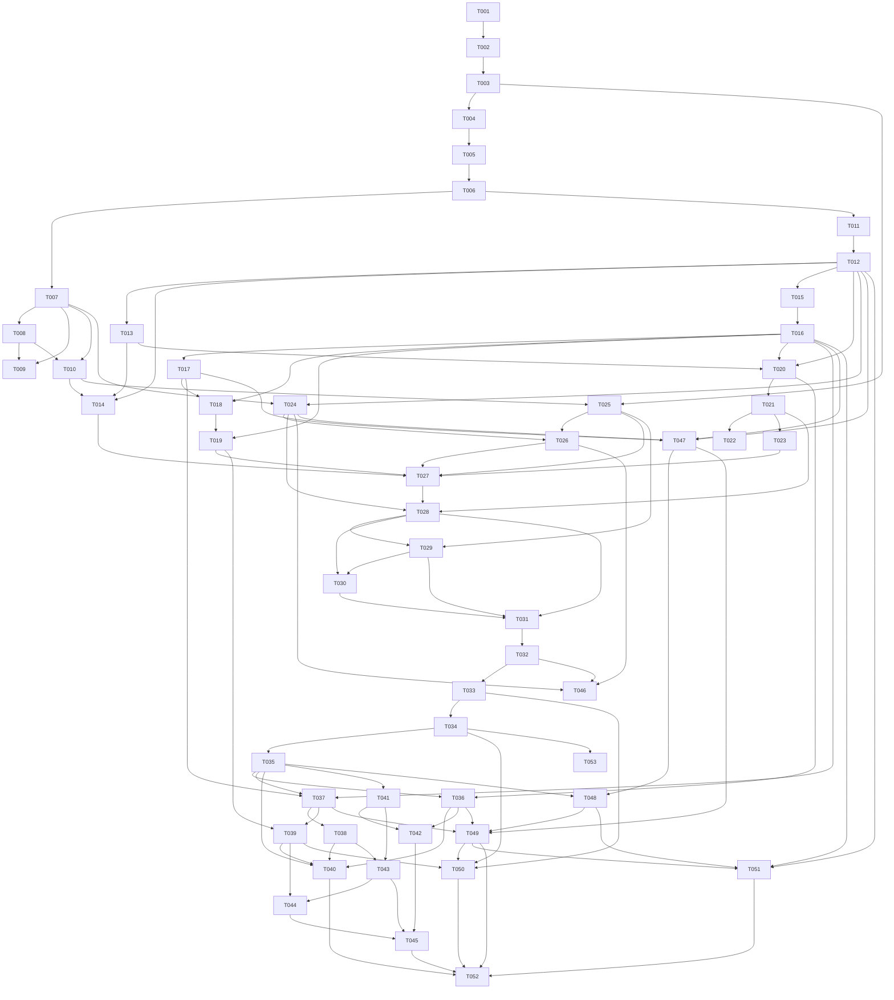

# Kinlayer MVP Implementation Plan

> **For agentic workers:** REQUIRED SUB-SKILL: Use `superpowers:subagent-driven-development` (recommended) or `superpowers:executing-plans` to implement this plan task-by-task. Track progress by updating each task's `Status` and checking off Acceptance Criteria.

**Goal:** Build the complete Kinlayer MVP: a local-first, single-user relationship context layer for AI agents with canonical HTTP API, CLI, Web control plane, provenance, candidates, corrections, policy-aware context packaging, graph view, and embedding-backed retrieval.

**Architecture:** Postgres is the canonical store for relationship context, provenance, candidate review, ontology registries, fuzzy search, and vector search. FastAPI owns all state-changing capabilities; the Typer CLI and React/Vite Web UI are clients of the same API. Implementation proceeds through task-sized vertical slices so each stage leaves the app runnable.

**Tech Stack:** Python 3.11+, FastAPI, SQLAlchemy 2.x, Alembic, Pydantic, Typer, httpx, sentence-transformers, Postgres 16 with `pgvector` and `pg_trgm`, React, Vite, TypeScript, React Flow, Docker Compose.

---

## Tracking Rules

Status values:

- `Backlog`: not ready because dependencies remain.
- `Ready`: dependencies are satisfied and the task can start.
- `In Progress`: actively being implemented.
- `Blocked`: cannot proceed without a decision or external state change.
- `Done`: implementation and acceptance criteria are verified.

Priority values:

- `Critical`: required for core MVP correctness or blocks many tasks.
- `High`: required for MVP user/agent workflows.
- `Medium`: important for complete UX, hardening, or maintainability.
- `Low`: useful polish or future-friendly cleanup.

Global rules:

- HTTP API is canonical. No Web-only state-changing capability.
- MVP is single-user and local-first. Do not add users, sessions, organizations, workspaces, billing, cloud sync, or multi-user auth.
- Optional `KINLAYER_API_TOKEN` protects every endpoint except `GET /api/system/health` and `GET /api/system/version`.
- Store bounded episode excerpts and hashes only. Do not store full raw conversation bodies.
- AI-inferred context enters `candidates`; explicit user corrections in agent conversation use direct correction apply.
- Edges represent structural relationships only. Feelings, cautions, patterns, strategy, and recent interactions are observations.
- Default deletes are soft delete, deprecate, archive, or supersede semantics. Protected self cannot be deleted.
- Context APIs retrieve, score, filter, and package context. They do not generate final advice, message drafts, or natural-language briefings.
- Before Docker operations, inspect current bindings and avoid honcho ports `8000`, `6379`, and `5432`.
- Do not commit or push unless explicitly asked.

---

## File Responsibility Map

Backend target structure:

- `backend/src/kinlayer_backend/models.py`: SQLAlchemy models and table relationships.
- `backend/src/kinlayer_backend/schemas/`: Pydantic request/response models grouped by API domain.
- `backend/src/kinlayer_backend/repositories/`: DB access helpers for entities, observations, candidates, retrieval, and graph queries.
- `backend/src/kinlayer_backend/services/`: domain behavior for ontology seed validation, self bootstrap, candidate resolution, corrections, embeddings, retrieval scoring, policy bucketing, and context cards.
- `backend/src/kinlayer_backend/api/`: FastAPI routers for system, entities, aliases, entity facts, edges, observations, episodes, candidates, corrections, context, graph, ontology, and embeddings.
- `backend/src/kinlayer_backend/cli.py`: Typer commands that call or mirror API contracts.
- `backend/alembic/versions/`: schema migrations.
- `backend/tests/`: API/service/CLI tests and smoke fixtures.

Frontend target structure:

- `frontend/src/api/`: typed API client, auth token handling, and shared error handling.
- `frontend/src/routes/`: screen components for `/people`, `/people/new`, `/people/:id`, `/candidates`, `/graph`, `/retrieval-debug`, `/settings`.
- `frontend/src/components/`: reusable forms, tables, policy badges, evidence panels, context sections, and graph detail panels.
- `frontend/src/types/`: API response/request TypeScript types.
- `frontend/src/App.tsx`: route shell only.

Scripts and docs:

- `scripts/`: smoke scripts for local API/CLI/Web acceptance checks.
- `README.md`: current runbook and verification commands.
- `docs/README.md`: documentation map and active/archive boundaries.
- `docs/specs/acceptance-scenarios.md`: journey-level exit bar; add fixture-level examples only when behavior stabilizes.

---

## Task Index

| Task | Title | Priority | Status | Depends on |
| --- | --- | --- | --- | --- |
| T001 | Repository baseline and ground rules | Critical | Done | None |
| T002 | Docker, API, Web scaffold | Critical | Done | T001 |
| T003 | System API, config, and CLI baseline | Critical | Done | T002 |
| T004 | Quality and smoke-test baseline | High | Done | T001, T002, T003 |
| T005 | Backend architecture split | High | Done | T004 |
| T006 | Core entity and ontology schema | Critical | Done | T005 |
| T007 | Entity, alias, and fact API | Critical | Done | T006 |
| T008 | Protected self bootstrap | Critical | Done | T006, T007 |
| T009 | People CLI commands | High | Done | T007, T008 |
| T010 | People Web bootstrap screens | High | Done | T007, T008 |
| T011 | Relationship, observation, episode, evidence schema | Critical | Done | T006 |
| T012 | Edge, observation, and episode API | Critical | Done | T011 |
| T013 | Embedding provider, status, and backfill | Critical | Done | T011, T012 |
| T014 | Person detail relationship/evidence UI | High | Done | T010, T012, T013 |
| T015 | Candidate schema and payload validation | Critical | Done | T012 |
| T016 | Candidate lifecycle API and canonical writes | Critical | Done | T015 |
| T017 | Explicit correction apply API | Critical | Done | T012, T016 |
| T018 | Candidate and correction CLI | High | Done | T016, T017 |
| T019 | Candidate inbox Web UI | High | Done | T016, T018 |
| T020 | Retrieval scoring and policy engine | Critical | Done | T012, T013, T016 |
| T021 | Context retrieve, pack, and context-card API | Critical | Done | T020 |
| T022 | Retrieval and context CLI | High | Done | T021 |
| T023 | Retrieval debug Web UI | High | Done | T021 |
| T024 | Graph and ontology read API | High | Done | T007, T012 |
| T025 | Web API client, routing, and settings | High | Done | T003, T010 |
| T026 | Ego graph Web UI | Medium | Done | T024, T025 |
| T027 | Full Web control-plane integration | High | Done | T014, T019, T023, T025, T026 |
| T028 | Acceptance fixtures and smoke scripts | High | Done | T021, T024, T027 |
| T029 | Optional token end-to-end hardening | High | Done | T025, T028 |
| T030 | README and specification consistency pass | Medium | Done | T028, T029 |
| T031 | MVP exit verification | Critical | Done | T028, T029, T030 |
| T032 | People profile edit Web UI | High | Done | T031 |
| T033 | Structured contact and identity facts | High | Done | T032 |
| T034 | Agent-compatible profile fact updates | High | Done | T033 |
| T035 | AI agent vs Kinlayer responsibility boundary docs | Critical | Done | T034 |
| T036 | Agent-facing entity resolution API | High | Ready | T020, T035 |
| T037 | Agent candidate provenance and correction audit hardening | Critical | Ready | T016, T017, T035 |
| T038 | Atomic canonical write transactions | Critical | Backlog | T037 |
| T039 | Candidate review UI provenance and action gating | High | Backlog | T019, T037 |
| T040 | Post-turn integration examples and acceptance smoke | High | Backlog | T035, T036, T038, T039 |
| T041 | Person merge policy and contract docs | Critical | Ready | T035 |
| T042 | Duplicate detection and merge-candidate creation | High | Backlog | T036, T041 |
| T043 | Atomic person merge execution API | Critical | Backlog | T038, T041 |
| T044 | Merge review CLI and Web workflow | High | Backlog | T039, T043 |
| T045 | Merge acceptance fixtures and retrieval verification | High | Backlog | T042, T043, T044 |
| T046 | Admin Web UI ID hiding and ontology-backed relationship controls | High | Done | T024, T026, T032 |
| T047 | Relationship edge-type enforcement audit and debug logging | Critical | Done | T012, T016, T017, T024 |
| T048 | Agent Write Instruction Pack | Critical | Done | T035, T047 |
| T049 | Agent write schema guard, low-risk normalization, and diagnostics filter | Critical | Backlog | T036, T037, T047, T048 |
| T050 | Structured profile fact promotion workflow | High | Backlog | T033, T034, T039, T049 |
| T051 | Temporal observation recording and candidate payload preservation | High | Backlog | T012, T016, T048, T049 |
| T052 | Optional LLM-assisted background curation | Low | Backlog | T040, T045, T049, T050, T051 |
| T053 | Agent write operation export and Web download | High | Done | T034 |

---

## Completed Baseline

#### Task T001. Repository baseline and ground rules
- Priority: Critical
- Status: Done
- Depends on: None
- Acceptance Criteria:
  - [x] Git repository is initialized in `/Users/gyurin/dev/kinlayer`.
  - [x] `AGENTS.md` defines Kinlayer-local ground rules.
  - [x] `.gitignore` excludes Python, frontend, build, cache, and local env artifacts.
  - [x] `.dockerignore` files reduce Docker build context noise.
  - [x] `README.md` lists local defaults and basic run commands.
- Notes:
  - Default ports are API `8765`, Web `5173`, Postgres host `15432`.
  - No commit has been made yet.

#### Task T002. Docker, API, Web scaffold
- Priority: Critical
- Status: Done
- Depends on: T001
- Acceptance Criteria:
  - [x] `docker-compose.yml` defines Postgres, API, and Web services.
  - [x] Postgres uses a pgvector-capable image and exposes host port `127.0.0.1:15432`.
  - [x] API exposes host port `8765` beyond loopback.
  - [x] Web exposes host port `5173` beyond loopback.
  - [x] Docker startup was verified without conflicting with honcho `8000`, `6379`, or `5432`.
  - [x] Frontend app shell renders through the Codex in-app browser.
- Notes:
  - Current containers may already be running locally: `kinlayer-postgres`, `kinlayer-api`, `kinlayer-web`.

#### Task T003. System API, config, and CLI baseline
- Priority: Critical
- Status: Done
- Depends on: T002
- Acceptance Criteria:
  - [x] `GET /api/system/health` returns health, database, and embedding status.
  - [x] `GET /api/system/version` returns name, version, and API version.
  - [x] `GET /api/system/config` returns non-secret effective config.
  - [x] Optional bearer token middleware protects config while leaving health/version public.
  - [x] `kinlayer status --json` reads API health.
  - [x] Alembic initial migration enables `vector` and `pg_trgm`.
- Notes:
  - The baseline was verified with `uv run ruff check .`, Python import check, `npm run build`, `docker compose up -d --build`, `curl`, Alembic, CLI status, and browser rendering.

---

## Scaffold Hardening

#### Task T004. Quality and smoke-test baseline
- Priority: High
- Status: Done
- Depends on: T001, T002, T003
- Acceptance Criteria:
  - [x] Backend test dependencies are added to `pyproject.toml`.
  - [x] `backend/tests/` contains system endpoint and optional token tests.
  - [x] CLI smoke coverage verifies `kinlayer status --json`.
  - [x] `scripts/smoke-slice0.sh` runs Docker port inspection, compose startup, Alembic, API health, CLI status, and frontend build.
  - [x] `README.md` lists the exact local verification commands.
  - [x] `uv run ruff check .`, `uv run pytest`, and `cd frontend && npm run build` pass locally.
- Notes:
  - This task deliberately adds tests after the scaffold baseline because the initial scaffold was created without test files by user request.

#### Task T005. Backend architecture split
- Priority: High
- Status: Done
- Depends on: T004
- Acceptance Criteria:
  - [x] `backend/src/kinlayer_backend/api/` contains routers separated by API domain.
  - [x] `backend/src/kinlayer_backend/schemas/` contains shared and domain-specific Pydantic schemas.
  - [x] `backend/src/kinlayer_backend/repositories/` contains DB access boundaries.
  - [x] `backend/src/kinlayer_backend/services/` contains domain behavior boundaries.
  - [x] `main.py` registers routers without holding domain logic.
  - [x] Existing system API and CLI behavior still pass the T004 smoke checks.
- Notes:
  - Keep the split small and concrete. Do not create abstraction layers that are not used by Slice 1.

---

## Core Entity Bootstrap

#### Task T006. Core entity and ontology schema
- Priority: Critical
- Status: Done
- Depends on: T005
- Acceptance Criteria:
  - [x] SQLAlchemy models exist for `entities`, `entity_aliases`, `entity_facts`, and required ontology registry tables.
  - [x] Alembic migration creates those tables from an empty DB.
  - [x] Migration preserves the existing `vector` and `pg_trgm` extension setup.
  - [x] Registry seed values exist for entity types, fact types, claim types, sensitivity levels, and AI use policies.
  - [x] `entity_facts.fact_type` is validated against registry-backed seed/config values.
  - [x] Model indexes include entity type, canonical name, confirmation status, protected self uniqueness, alias normalized name, and trgm search where applicable.
- Notes:
  - Use latest PRD/API decisions over stale `docs/specs/data-model.md` open questions: fact types are registry-backed, and `canonical_record_ref` remains string-based later.

#### Task T007. Entity, alias, and fact API
- Priority: Critical
- Status: Done
- Depends on: T006
- Acceptance Criteria:
  - [x] Entity endpoints implement create/list/get/patch/delete under `/api/entities`.
  - [x] Alias endpoints implement create/list/patch/delete under `/api/entities/{id}/aliases` and `/api/aliases/{id}`.
  - [x] Entity fact endpoints implement create/list/get/patch/delete under `/api/entity-facts`.
  - [x] List endpoints return `{items, limit, offset, total}`.
  - [x] Controlled values return `validation_error` using the common API error shape.
  - [x] DELETE operations apply soft-delete/deprecated semantics, not physical purge.
  - [x] Optional bearer token protection applies to every new endpoint.
- Notes:
  - API behavior must follow `docs/specs/api-spec.md` and keep Web/CLI as clients.

#### Task T008. Protected self bootstrap
- Priority: Critical
- Status: Done
- Depends on: T006, T007
- Acceptance Criteria:
  - [x] `kinlayer init` creates or confirms one protected self entity.
  - [x] Self entity has `entity_type = person`, `system_role = self`, and `is_system = true`.
  - [x] Re-running init is idempotent and does not create duplicate self rows.
  - [x] Protected self cannot be deleted through `DELETE /api/entities/{id}`.
  - [x] Protected self cannot lose system role through `PATCH /api/entities/{id}`.
  - [x] Tests cover duplicate prevention and forbidden mutation cases.
- Notes:
  - Self relationships are represented as normal edges in later tasks.

#### Task T009. People CLI commands
- Priority: High
- Status: Done
- Depends on: T007, T008
- Acceptance Criteria:
  - [x] `kinlayer person create --name ...` creates a person through API-compatible behavior.
  - [x] `kinlayer person create` supports repeatable `--alias`.
  - [x] `kinlayer person create` supports `--note`, `--sensitivity`, `--ai-use-policy`, and `--json`.
  - [x] `kinlayer person list --query ... --json` returns API-backed search results.
  - [x] `kinlayer person show <entity_id> --json` returns entity details, aliases, and facts.
  - [x] CLI errors are readable in human mode and machine-readable in JSON mode.
- Notes:
  - CLI must not diverge from API validation or token behavior.

#### Task T010. People Web bootstrap screens
- Priority: High
- Status: Done
- Depends on: T007, T008
- Acceptance Criteria:
  - [x] `/people` lists people from the API.
  - [x] `/people` supports API-backed name/alias search.
  - [x] `/people/new` creates a person with aliases, sensitivity, AI use policy, short note, and profile fact fields.
  - [x] `/people/new` redirects to `/people/:id` after successful creation.
  - [x] `/people/:id` shows entity summary, aliases, and profile facts.
  - [x] Browser verification confirms all three routes load without console errors.
- Notes:
  - Keep UI operational and compact. Do not build a CRM-style dashboard.

---

## Relationships, Observations, Provenance, and Embeddings

#### Task T011. Relationship, observation, episode, evidence schema
- Priority: Critical
- Status: Done
- Depends on: T006
- Acceptance Criteria:
  - [x] SQLAlchemy models and migration exist for `entity_edges`, `observations`, `observation_entities`, and `episodes`.
  - [x] SQLAlchemy models and migration exist for `entity_fact_evidence`, `edge_evidence`, and `observation_evidence`.
  - [x] Registry seed values exist for edge types, observation types, retention policies, and evidence-related controlled values.
  - [x] Observation model includes embedding status fields and pgvector column.
  - [x] Foreign keys preserve evidence integrity.
  - [x] Migration succeeds on both empty DB and DB containing Slice 1 data.
- Notes:
  - Do not add full raw episode body storage.

#### Task T012. Edge, observation, and episode API
- Priority: Critical
- Status: Done
- Depends on: T011
- Acceptance Criteria:
  - [x] Edge endpoints implement create/list/get/patch/delete under `/api/edges`.
  - [x] Observation endpoints implement create/list/get/patch/delete under `/api/observations`.
  - [x] Episode endpoints implement create/list/get under `/api/episodes`.
  - [x] Edge validation requires registry-backed structural `relation_type`.
  - [x] Observation related entities are stored through `observation_entities`.
  - [x] Episode responses expose metadata, bounded excerpt, and hash only.
  - [x] Edge and observation DELETE operations set deleted/deprecated status and `valid_to` where applicable.
- Notes:
  - Ambiguous advisory or emotional content should become an observation, not an edge.

#### Task T013. Embedding provider, status, and backfill
- Priority: Critical
- Status: Done
- Depends on: T011, T012
- Acceptance Criteria:
  - [x] Embedding service supports disabled provider for local scaffold.
  - [x] OpenAI-compatible provider works through `httpx` and env/config values.
  - [x] Local sentence-transformers provider supports `dragonkue/multilingual-e5-small-ko-v2` and optional `nlpai-lab/KURE-v1`.
  - [x] Observation create/update attempts synchronous embedding generation.
  - [x] Embedding failure still saves the observation with `pending` or `failed` status.
  - [x] `GET /api/embeddings/status` returns provider/model/dim/status and observation counts.
  - [x] `POST /api/embeddings/backfill` processes pending/failed/stale observations.
  - [x] `kinlayer embedding status` and `kinlayer embedding backfill` work.
- Notes:
  - MVP semantic retrieval is required; embedding can fail gracefully but must not be omitted from the design.

#### Task T014. Person detail relationship/evidence UI
- Priority: High
- Status: Done
- Depends on: T010, T012, T013
- Acceptance Criteria:
  - [x] `/people/new` can add an optional initial relationship edge to protected self.
  - [x] `/people/new` can add an optional initial observation.
  - [x] `/people/:id` shows relationship edges.
  - [x] `/people/:id` shows stable and recent observations.
  - [x] `/people/:id` shows evidence/provenance summaries for facts, edges, and observations.
  - [x] `/settings` shows embedding provider/model/dim/status without exposing secrets.
- Notes:
  - This completes Acceptance Scenario A together with earlier entity work.

---

## Candidates and Corrections

#### Task T015. Candidate schema and payload validation
- Priority: Critical
- Status: Done
- Depends on: T012
- Acceptance Criteria:
  - [x] SQLAlchemy models and migration exist for `candidates` and `candidate_evidence`.
  - [x] Pydantic schemas validate common candidate envelope fields.
  - [x] Typed payload schemas exist for `new_entity`, `alias`, `profile_field`, `relationship_edge`, `observation`, `merge`, `conflict`, and `supersede`.
  - [x] Invalid payloads return common `validation_error` responses.
  - [x] Evidence rows store `candidate_id`, `episode_id`, excerpt, confidence, and created timestamp.
  - [x] Candidate status defaults to `pending`.
- Notes:
  - Candidate payloads remain JSONB in DB; API validates shape by `candidate_type`.

#### Task T016. Candidate lifecycle API and canonical writes
- Priority: Critical
- Status: Done
- Depends on: T015
- Acceptance Criteria:
  - [x] Candidate create/list/get endpoints work.
  - [x] Metadata-only candidate patch does not resolve candidates.
  - [x] Candidate delete archives rather than purges.
  - [x] Action endpoints exist for accept, edit-accept, reject, archive, needs-clarification, and supersede.
  - [x] Accept writes the matching canonical record immediately.
  - [x] Edit-accept validates edited payload and writes canonical record from edited payload.
  - [x] Accepted candidates store `canonical_record_ref` as `<record_type>:<uuid>`.
  - [x] Canonical evidence is linked where applicable.
- Notes:
  - Batch changesets are out of MVP.

#### Task T017. Explicit correction apply API
- Priority: Critical
- Status: Done
- Depends on: T012, T016
- Acceptance Criteria:
  - [x] `POST /api/corrections/apply` accepts explicit correction requests.
  - [x] Request requires `correction_source.user_explicit = true`.
  - [x] Agent-inferred corrections are rejected from direct apply and must use candidates.
  - [x] Correction apply creates a bounded correction episode.
  - [x] Old canonical record is superseded or deprecated.
  - [x] New canonical record is active.
  - [x] Evidence links point to the correction episode.
  - [x] Retrieval-visible state immediately reflects the corrected record.
- Notes:
  - The direct path is for explicit user correction in an AI-agent conversation.

#### Task T018. Candidate and correction CLI
- Priority: High
- Status: Done
- Depends on: T016, T017
- Acceptance Criteria:
  - [x] `kinlayer candidate submit <candidate.json>` submits typed candidates.
  - [x] `kinlayer candidate list/show` support JSON output.
  - [x] `kinlayer candidate accept/edit-accept/reject/archive/clarify` call the matching action endpoints.
  - [x] `kinlayer correction apply <correction.json>` calls correction apply.
  - [x] CLI reports canonical record refs after accept/edit-accept.
  - [x] CLI handles API token mode.
- Notes:
  - Advanced unwrapped operations remain reachable through raw API command work from later CLI hardening.

#### Task T019. Candidate inbox Web UI
- Priority: High
- Status: Done
- Depends on: T016, T018
- Acceptance Criteria:
  - [x] `/candidates` lists pending candidates by default.
  - [x] Candidate inbox supports type, status, and sensitivity filters.
  - [x] Candidate detail panel shows typed payload and evidence excerpts.
  - [x] Accept, reject, archive, and needs-clarification actions work from UI.
  - [x] Edit-accept form validates edited payload before submission.
  - [x] UI shows resulting canonical record ref after accept/edit-accept.
  - [x] Browser verification confirms actions update API state.
- Notes:
  - No candidate action may be Web-only.

---

## Retrieval and Context Packaging

#### Task T020. Retrieval scoring and policy engine
- Priority: Critical
- Status: Done
- Depends on: T012, T013, T016
- Acceptance Criteria:
  - [x] Exact and normalized entity/alias matching works.
  - [x] pg_trgm fuzzy name/alias search contributes to scoring.
  - [x] pgvector semantic observation search works over `observations.content`.
  - [x] Score constants match PRD/API values: entity hint `0.25`, alias/name `0.20`, semantic observation `0.20`, recency `0.15`, graph proximity `0.10`, confirmation/policy `0.10`.
  - [x] Penalties apply for ambiguity, sensitivity/surface constraints, stale/deprecated status, and policy blocks.
  - [x] Confidence bands use high `>= 0.75`, medium `>= 0.45`, low `< 0.45`.
  - [x] Ambiguity guard prevents or downgrades high confidence in ambiguous implicit-reference cases.
  - [x] Surface buckets compute `direct_surface`, `conditional_surface`, `internal_only`, and `blocked`.
- Notes:
  - Retrieval must remain hybrid; do not implement vector-only retrieval.

#### Task T021. Context retrieve, pack, and context-card API
- Priority: Critical
- Status: Done
- Depends on: T020
- Acceptance Criteria:
  - [x] `POST /api/context/retrieve` returns matched entities, observations, scores, match reasons, score breakdown, and debug metadata.
  - [x] `POST /api/context/pack` returns `context_pack` with confidence, suggested response policy, matched entities, buckets, recent/stable context, cautions, provenance, and optional debug.
  - [x] `GET /api/entities/{id}/context-card` returns entity, aliases, profile facts, relationship edges, stable context, recent context, communication context, cautions, provenance summary, and retrieval hints.
  - [x] Context pack never emits final relationship advice or message drafts.
  - [x] `never_surface` context is never placed in `direct_surface`.
  - [x] Low confidence or ambiguity maps to `ask_clarifying_question`.
  - [x] All context endpoints obey optional API token mode.
- Notes:
  - This is the main AI-agent retrieval contract.

#### Task T022. Retrieval and context CLI
- Priority: High
- Status: Done
- Depends on: T021
- Acceptance Criteria:
  - [x] `kinlayer retrieve "..."` calls `/api/context/retrieve`.
  - [x] `kinlayer context-card <entity_id>` calls the context-card endpoint.
  - [x] `kinlayer context pack "..."` calls `/api/context/pack`.
  - [x] `kinlayer debug retrieval "..."` returns score breakdown and debug metadata.
  - [x] Commands support `--json`.
  - [x] Commands handle API token mode.
- Notes:
  - CLI output should be agent-callable and script-friendly.

#### Task T023. Retrieval debug Web UI
- Priority: High
- Status: Done
- Depends on: T021
- Acceptance Criteria:
  - [x] `/retrieval-debug` includes query and situation text inputs.
  - [x] `/retrieval-debug` supports focal/candidate entity inputs.
  - [x] UI displays raw retrieval result.
  - [x] UI displays context pack buckets.
  - [x] UI displays score breakdown and semantic metadata.
  - [x] Browser verification confirms Korean semantic retrieval debug output is visible.
- Notes:
  - This screen is for tuning and inspection, not daily CRM usage.

---

## Graph, Ontology, and Web Control Plane

#### Task T024. Graph and ontology read API
- Priority: High
- Status: Done
- Depends on: T007, T012
- Acceptance Criteria:
  - [x] `GET /api/graph/ego/{entity_id}` returns generic nodes and edges.
  - [x] Graph API officially supports `depth=1`.
  - [x] Focal node is marked `is_focal`.
  - [x] Graph filters support relation type, status, and sensitivity where API supports them.
  - [x] Graph response is not React Flow-specific.
  - [x] Read-only ontology endpoints return seed registries for all required types and policies.
  - [x] Ontology endpoints obey optional API token mode.
- Notes:
  - Full ontology editing and graph analytics are out of MVP.

#### Task T025. Web API client, routing, and settings
- Priority: High
- Status: Done
- Depends on: T003, T010
- Acceptance Criteria:
  - [x] `frontend/src/api/` contains a typed API client using `VITE_KINLAYER_API_URL`.
  - [x] API client supports optional local token entry without exposing token value in settings.
  - [x] Route shell supports `/people`, `/people/new`, `/people/:id`, `/candidates`, `/graph`, `/retrieval-debug`, and `/settings`.
  - [x] Common API error shape renders consistently.
  - [x] `/settings` shows health, API URL, token configured state, embedding state, and read-only ontology values.
  - [x] Frontend build passes.
- Notes:
  - Keep token handling local and simple; do not add login/session UI.

#### Task T026. Ego graph Web UI
- Priority: Medium
- Status: Done
- Depends on: T024, T025
- Acceptance Criteria:
  - [x] React Flow dependency is added.
  - [x] `/graph` renders 1-hop ego graph from generic graph API response.
  - [x] `/graph` supports entity selector.
  - [x] `/graph` supports relation/status/sensitivity filters.
  - [x] Clicking a node opens an entity detail panel.
  - [x] Clicking an edge opens relation detail.
  - [x] Browser verification confirms graph renders with self and two people.
- Notes:
  - Use React Flow as a frontend adapter only.

#### Task T027. Full Web control-plane integration
- Priority: High
- Status: Done
- Depends on: T014, T019, T023, T025, T026
- Acceptance Criteria:
  - [x] `/people` supports search, filters, aliases preview, relationship summary, status, sensitivity, and last referenced time.
  - [x] `/people/:id` includes context card preview, evidence panel, and policy/surface markers.
  - [x] `/candidates` supports complete review workflow.
  - [x] `/retrieval-debug` supports debug tuning workflow.
  - [x] `/settings` supports health/config/embedding/ontology inspection.
  - [x] No state-changing capability exists only in Web UI.
  - [x] Browser checks cover every MVP route without console errors.
- Notes:
  - This task integrates and polishes already implemented route-level work rather than creating new backend contracts.

---

## Acceptance Hardening

#### Task T028. Acceptance fixtures and smoke scripts
- Priority: High
- Status: Done
- Depends on: T021, T024, T027
- Acceptance Criteria:
  - [x] Deterministic fixture loader creates protected self, at least two people, aliases, facts, edges, observations, episodes, and evidence.
  - [x] Fixtures include one sensitive or `never_surface` observation.
  - [x] Fixtures include one Korean observation suitable for semantic retrieval.
  - [x] Fixtures include one pending candidate and one accepted candidate.
  - [x] API smoke script covers system, entities, aliases, facts, edges, observations, episodes, evidence, candidates, corrections, context, graph, ontology, and embeddings.
  - [x] CLI smoke script covers status, people, candidates, context/retrieval, correction, graph/debug, and embeddings.
  - [x] Web smoke checklist covers every MVP screen.
  - [x] Agent-like operation smoke submits episode and candidate records through API-compatible and CLI-compatible payloads.
  - [x] Candidate acceptance smoke verifies canonical record creation, `canonical_record_ref`, and evidence links.
  - [x] Context retrieve/pack smoke verifies accepted canonical context is returned after candidate acceptance.
  - [x] Explicit correction smoke verifies canonical state changes without candidate review.
  - [x] Post-correction retrieval smoke returns corrected active context and excludes superseded/deprecated context by default.
  - [x] Policy smoke verifies sensitive or `never_surface` context is considered but not placed in `direct_surface`.
  - [x] Web smoke checklist verifies the resulting person, evidence, candidate resolution, and retrieval debug state are inspectable.
- Notes:
  - Keep fixture data generic/open-source; do not encode private personal names.

#### Task T029. Optional token end-to-end hardening
- Priority: High
- Status: Done
- Depends on: T025, T028
- Acceptance Criteria:
  - [x] Starting with `KINLAYER_API_TOKEN` keeps health/version public.
  - [x] Relationship data read endpoint returns `401` without token.
  - [x] Same endpoint succeeds with correct bearer token.
  - [x] CLI passes token from config/env and never prints token value.
  - [x] Web client can send token and settings never display token value.
  - [x] Token mode is included in smoke scripts.
- Notes:
  - This is a local-first safety boundary, not multi-user auth.

#### Task T030. README and specification consistency pass
- Priority: Medium
- Status: Done
- Depends on: T028, T029
- Acceptance Criteria:
  - [x] `README.md` explains fresh setup, Docker startup, migrations, CLI usage, Web URL, token mode, and verification commands.
  - [x] `docs/specs/api-spec.md` matches implemented endpoint names and request/response shapes.
  - [x] `docs/specs/data-model.md` matches implemented schema and closed decisions.
  - [x] `docs/specs/cli-spec.md` matches implemented commands.
  - [x] `docs/specs/web-ui-spec.md` matches implemented screens.
  - [x] `docs/specs/acceptance-scenarios.md` includes fixture-level expected checks where useful.
  - [x] No docs refer to obsolete implementation sequencing.
- Notes:
  - Update product/spec docs only for real contract changes or drift discovered during implementation.

#### Task T031. MVP exit verification
- Priority: Critical
- Status: Done
- Depends on: T028, T029, T030
- Acceptance Criteria:
  - [x] Scenario A Bootstrap Seed passes.
  - [x] Scenario B Agent Conversation Creates Candidate passes.
  - [x] Scenario C Explicit Correction Direct Apply passes.
  - [x] Scenario D Ambiguous Implicit Person Retrieval passes.
  - [x] Scenario E Policy-Aware Surface passes.
  - [x] Scenario F Ego Graph View passes.
  - [x] Scenario G Embedding-Backed Korean Semantic Retrieval passes.
  - [x] Scenario H Optional API Token Protection passes.
  - [x] Scenario I Soft Delete Semantics passes.
  - [x] End-to-end agent-operation loop passes: agent-like input, API/CLI recording, candidate/correction/evidence persistence, canonical update, context retrieve/pack re-query, policy bucket verification, and Web inspection.
  - [x] Final verification commands pass from a fresh local Docker Compose environment.
- Notes:
  - Final verification command set:

```bash
docker ps --format 'table {{.Names}}\t{{.Ports}}'
docker compose down
docker compose up -d --build
uv run alembic upgrade head
uv run ruff check .
uv run pytest
cd frontend && npm run build
curl -fsS http://127.0.0.1:8765/api/system/health
uv run kinlayer status --json
```

---

## Post-MVP People Profile Management

#### Task T032. People profile edit Web UI
- Priority: High
- Status: Done
- Depends on: T031
- Acceptance Criteria:
  - [x] `/people/:id` supports editing `display_name`, `sensitivity`, `ai_use_policy`, and editable profile note fields through the canonical API.
  - [x] `/people/:id` supports adding, editing, and deleting aliases.
  - [x] `/people/:id` supports adding, editing, and deleting structural relationship edges.
  - [x] `/people/:id` supports deleting observations through soft-delete semantics.
  - [x] Web edit actions refresh the context card so aliases, facts, relationships, observations, and provenance reflect the latest canonical state.
  - [x] Web edit actions use the same API endpoints available to CLI and agent callers; no Web-only state-changing path is introduced.
  - [x] Frontend tests cover successful edit/delete flows and common API validation errors.
  - [x] Browser verification confirms edits are visible on the person detail page without console errors.
- Notes:
  - Keep observation editing out of this slice unless required by a narrower follow-up. Deleting observations is enough for this task.
  - Protected self mutation rules still apply.
  - Verified with `npm run test`, `npm run build`, and an in-app browser edit/delete pass against `/people/:id`.

#### Task T033. Structured contact and identity facts
- Priority: High
- Status: Done
- Depends on: T032
- Acceptance Criteria:
  - [x] Ontology seed/config values include structured person fact types for `legal_name`, `birth_date`, `phone`, `email`, `address`, `organization`, `role`, and `memo`.
  - [x] Existing `entity_facts` remains the canonical storage for structured person profile fields unless a later design proves a separate contact table is necessary.
  - [x] API validation accepts the structured fact types and continues to reject unknown fact types with the common `validation_error` shape.
  - [x] `/people/:id` groups structured profile facts separately from general profile facts.
  - [x] `/people/:id` supports adding, editing, and deleting structured profile facts.
  - [x] Structured fact writes preserve sensitivity, AI use policy, claim type, confidence, and evidence/provenance fields where applicable.
  - [x] Tests cover structured fact CRUD, validation, and context-card visibility.
- Notes:
  - Do not add multi-user contact ownership, account sync, or advanced phone/email normalization in this slice.
  - Store contact values as canonical facts first; add specialized columns only after concrete query or validation pressure appears.
  - Verified with targeted backend entity/context tests, full `uv run pytest`, `npm run test`, and `npm run build`.

#### Task T034. Agent-compatible profile fact updates
- Priority: High
- Status: Done
- Depends on: T033
- Acceptance Criteria:
  - [x] Agent-compatible candidate payloads can propose adding or changing structured person facts.
  - [x] Candidate accept and edit-accept can write structured fact canonical records and return `canonical_record_ref`.
  - [x] Explicit correction apply can supersede or replace structured profile facts without candidate review when `correction_source.user_explicit = true`.
  - [x] CLI commands or documented JSON payload examples cover structured profile fact candidate submission and explicit correction.
  - [x] Context retrieve, context pack, and context card reflect accepted or explicitly corrected structured facts.
  - [x] Smoke coverage verifies a profile fact added through an agent-compatible payload is inspectable and editable in Web UI.
- Notes:
  - Agent-inferred changes still go through candidates; direct correction remains reserved for explicit user corrections.
  - Verified with candidate/context/correction tests, updated API smoke coverage, and browser inspection of an agent-accepted profile fact on the Web detail page.

---

## Issue #1: Post-Turn Agent Boundary Hardening

#### Task T035. AI agent vs Kinlayer responsibility boundary docs
- Priority: Critical
- Status: Done
- Depends on: T034
- Files:
  - Modify: `docs/agents/agent-integration-notes.md`
  - Modify: `docs/specs/api-spec.md`
  - Modify: `docs/specs/candidate-lifecycle-and-payload.md`
  - Modify: `docs/specs/context-output-contract.md`
  - Modify: `docs/specs/acceptance-scenarios.md`
  - Modify: `docs/README.md`
- Acceptance Criteria:
  - [x] Docs state the product boundary in one canonical sentence: AI agents interpret current-turn user-authored text and propose candidates/corrections; Kinlayer validates, stores, retrieves, reviews, and canonicalizes.
  - [x] Docs explicitly state Kinlayer does not run an LLM for post-turn extraction and must not perform open-ended personhood, fictional/public-figure, or relationship-relevance classification.
  - [x] Post-turn hook contract says automatic extraction evidence may use only current-turn user-authored messages.
  - [x] Docs forbid assistant messages, tool output, retrieved context packs/cards, system/developer/skill prompts, logs, compacted summaries, and previous memory output as candidate evidence.
  - [x] Evidence excerpt guidance says submitted excerpts must be user-authored substrings or bounded user-authored snippets, not agent-generated interpretations.
  - [x] Exclusion taxonomy covers fictional characters, public figures, hypothetical examples, generic groups/professions, AI agents/bots/models, and the user as a normal person entity.
  - [x] Pronoun-only policy says references like `that person`, `그 사람`, `걔`, and `그분` must not create a new entity or update an existing entity without a reliable current-turn user-provided identifier.
  - [x] Candidate planning policy distinguishes AI inference, explicit correction, ambiguous/low-confidence context, multiple entity matches, and no-op decisions.
  - [x] Dry-run/audit expectations list mentions found, exclusions, entity-resolution results, planned candidates, no-op reasons, and redacted/log-safe metadata.
  - [x] Docs clarify that agent-side thresholds are adapter configuration, not Kinlayer core behavior.
- Notes:
  - This task is documentation-first and should not add an agent runtime hook.
  - Treat `needs_clarification` as a candidate status/action, not a `candidate_type`, unless a later API design explicitly proves a new type is necessary.
  - Keep examples bilingual where helpful because Korean relationship references are first-class product examples.
  - Completed by `docs: add agent write instruction pack` plus the T035 boundary cleanup pass.

#### Task T036. Agent-facing entity resolution API
- Priority: High
- Status: Done
- Depends on: T020, T035
- Files:
  - Modify: `docs/specs/api-spec.md`
  - Modify: `backend/src/kinlayer_backend/api/entities.py`
  - Modify: `backend/src/kinlayer_backend/schemas/entities.py`
  - Modify: `backend/src/kinlayer_backend/services/entities.py`
  - Modify: `backend/src/kinlayer_backend/repositories/entities.py`
  - Modify: `backend/src/kinlayer_backend/cli.py`
  - Test: `backend/tests/test_entities_api.py`
  - Test: `backend/tests/test_cli.py`
- Acceptance Criteria:
  - [ ] `POST /api/entities/resolve` accepts `surface`, optional `aliases`, optional `relation_hint`, optional `entity_type`, and `source`.
  - [ ] Resolve response returns `matches`, `ambiguity`, and per-match `entity_id`, `display_name`, `score`, and `match_reasons`.
  - [ ] Deterministic matching covers exact display name, canonical name, exact alias, normalized alias, and fuzzy name/alias matches available in the current DB layer.
  - [ ] The endpoint may use embeddings or retrieval hints when available, but it must not call an LLM or decide whether a mention is fictional/public/relationship-relevant.
  - [ ] Ambiguity states distinguish `no_match`, `single_strong_match`, `multiple_close_matches`, and `low_confidence_match`.
  - [ ] Protected `self` may be returned only when explicitly requested by system role or when the request clearly targets self; normal person resolution must not silently target `self`.
  - [ ] CLI exposes an agent-callable JSON command for entity resolution.
  - [ ] Tests cover no match, single exact alias match, multiple ambiguous matches, protected self exclusion, and API token protection.
- Notes:
  - This is a support primitive for agents. It should return evidence for agent decisions, not make the final write/no-write decision.
  - If a full vector resolver is too large for this slice, ship deterministic scoring first and leave vector expansion behind the same response contract.

#### Task T037. Agent candidate provenance and correction audit hardening
- Priority: Critical
- Status: Ready
- Depends on: T016, T017, T035
- Files:
  - Modify: `docs/specs/api-spec.md`
  - Modify: `docs/specs/candidate-lifecycle-and-payload.md`
  - Modify: `backend/src/kinlayer_backend/schemas/candidates.py`
  - Modify: `backend/src/kinlayer_backend/services/candidates.py`
  - Modify: `backend/src/kinlayer_backend/schemas/corrections.py`
  - Modify: `backend/src/kinlayer_backend/services/corrections.py`
  - Modify: `backend/src/kinlayer_backend/models.py`
  - Add: `backend/alembic/versions/20260612_0005_agent_provenance_contract.py`
  - Test: `backend/tests/test_candidates_api.py`
  - Test: `backend/tests/test_corrections_api.py`
- Acceptance Criteria:
  - [ ] Agent-submitted candidates require at least one evidence item unless `created_by` is `user` and the candidate is explicitly manual.
  - [ ] Agent-submitted evidence requires an existing episode, non-empty excerpt, confidence in `[0, 1]`, and provenance fields sufficient to trace source type/ref.
  - [ ] Evidence validation rejects missing episode IDs, empty excerpts, nonexistent episodes, and excerpts attached to unsupported source types with the common `validation_error` shape.
  - [ ] Docs and API examples show `source_message_id` and `source_turn_id` in `source_ref` or structured provenance fields when the agent runtime can provide them.
  - [ ] Correction apply separates the user-authored correction source from the API submitter, for example `source_actor = user` and `submitted_by = ai_agent`.
  - [ ] Direct correction apply still requires `correction_source.user_explicit = true`.
  - [ ] Direct correction apply rejects ambiguous targets by requiring exactly one supported `old_record_ref`.
  - [ ] Tests prove agent-inferred corrections with `user_explicit = false` are rejected and must enter candidates.
  - [ ] Tests prove explicit correction evidence records the user as the correction source while preserving the submitting agent/runtime identity.
- Notes:
  - Do not try to cryptographically prove user-authored excerpts in this slice. Make the contract explicit and store enough provenance for later hash/offset verification.
  - If schema changes are needed, preserve backwards-compatible reads for existing local data where practical.

#### Task T038. Atomic canonical write transactions
- Priority: Critical
- Status: Backlog
- Depends on: T037
- Files:
  - Modify: `backend/src/kinlayer_backend/repositories/candidates.py`
  - Modify: `backend/src/kinlayer_backend/repositories/entities.py`
  - Modify: `backend/src/kinlayer_backend/repositories/relationships.py`
  - Modify: `backend/src/kinlayer_backend/services/candidates.py`
  - Modify: `backend/src/kinlayer_backend/services/corrections.py`
  - Test: `backend/tests/test_candidates_api.py`
  - Test: `backend/tests/test_corrections_api.py`
- Acceptance Criteria:
  - [ ] Candidate accept writes canonical record, copies evidence, sets `canonical_record_ref`, and resolves candidate in one transaction.
  - [ ] Candidate edit-accept validates edited payload and performs the same canonical write transaction atomically.
  - [ ] Correction apply writes the replacement record, creates the correction episode, links evidence, supersedes the old record, and returns refs in one transaction.
  - [ ] Repository helpers no longer commit mid-operation when called from candidate/correction service flows.
  - [ ] Failure-injection tests prove a simulated evidence-link failure leaves no accepted candidate and no orphan canonical record.
  - [ ] Failure-injection tests prove a simulated correction failure leaves the old record active and no replacement record visible.
  - [ ] Existing API/CLI smoke behavior remains unchanged for successful accept/edit-accept/correction flows.
- Notes:
  - This task is about DB consistency, not API shape changes.
  - Prefer explicit service-level transaction boundaries over broad hidden commits inside repository helpers.

#### Task T039. Candidate review UI provenance and action gating
- Priority: High
- Status: Backlog
- Depends on: T019, T037
- Files:
  - Modify: `frontend/src/routes/Candidates.tsx`
  - Modify: `frontend/src/api/client.ts`
  - Modify: `frontend/src/types/candidates.ts`
  - Modify: `frontend/src/styles.css`
  - Test: `frontend/src/App.test.tsx`
  - Test: `frontend/src/api/client.test.ts`
  - Modify: `scripts/web-smoke-checklist.md`
- Acceptance Criteria:
  - [ ] `/candidates` status filter includes every lifecycle status: `pending`, `accepted`, `edited_accepted`, `rejected`, `archived`, `needs_clarification`, and `superseded`.
  - [ ] Candidate detail displays `created_by`, `confidence`, `suggested_action`, `target_entity_id`, `canonical_record_ref`, `supersedes_candidate_id`, and `supersedes_record_ref` where present.
  - [ ] Evidence panel displays excerpt, confidence, episode ID, source type, source ref, source description, body hash, and actor when returned by the API.
  - [ ] UI disables or hides Accept/Edit-accept for review-only candidate types such as `merge`, `conflict`, and `supersede` when the server cannot canonicalize them directly.
  - [ ] UI exposes Reject, Archive, Needs clarification, and Supersede actions only when valid for the selected candidate status.
  - [ ] UI shows server validation errors clearly when a lifecycle action is rejected.
  - [ ] Browser or equivalent visual verification confirms candidate evidence and action gating are inspectable.
- Notes:
  - Keep the UI a control plane. Do not add LLM explanations, generated advice, or automatic extraction controls.
  - Use existing API endpoints first; add backend response fields only if the UI cannot inspect required provenance through current data.

#### Task T040. Post-turn integration examples and acceptance smoke
- Priority: High
- Status: Backlog
- Depends on: T035, T036, T038, T039
- Files:
  - Modify: `docs/agents/agent-integration-notes.md`
  - Modify: `docs/specs/acceptance-scenarios.md`
  - Modify: `README.md`
  - Modify: `scripts/smoke-acceptance-api.py`
  - Modify: `scripts/smoke-acceptance-cli.sh`
  - Test: `backend/tests/test_candidates_api.py`
  - Test: `backend/tests/test_corrections_api.py`
  - Test: `backend/tests/test_context_api.py`
- Acceptance Criteria:
  - [ ] Docs include example flow for named person: `민지한테 답장 뭐라 하지?` resolves or creates candidates without direct canonical write.
  - [ ] Docs include example flow for pronoun-only ambiguity: `그 사람이 또 연락했어` becomes no-op or `needs_clarification`, never a new entity.
  - [ ] Docs include example flow for explicit correction: `Alex는 직장 동료가 아니라 사촌이야` uses correction apply only when target is unambiguous.
  - [ ] Docs include example flow for public figure/news subject and fictional/example/generic group mentions that produce no Kinlayer candidate.
  - [ ] API smoke submits an agent-like episode and candidate with required provenance, accepts it, and verifies canonical evidence linkage.
  - [ ] API smoke verifies explicit correction provenance and corrected retrieval behavior after correction apply.
  - [ ] CLI smoke covers entity resolve, candidate submit/list/show, candidate accept/reject/clarify, and correction apply.
  - [ ] Context retrieve/pack smoke proves rejected and ambiguous candidates do not surface as trusted confirmed context.
  - [ ] Final verification runs backend tests, CLI/API smoke, frontend tests/build, and browser verification for `/candidates` when frontend changes are included.
- Notes:
  - This is the exit bar for GitHub Issue #1.
  - Agent-side post-turn hooks, skills, plugins, and MCP adapters remain outside Kinlayer core unless a later task explicitly scopes them.

---

## Person Entity Merge and Duplicate Control

#### Task T041. Person merge policy and contract docs
- Priority: Critical
- Status: Ready
- Depends on: T035
- Files:
  - Modify: `docs/specs/prd.md`
  - Modify: `docs/specs/data-model.md`
  - Modify: `docs/specs/api-spec.md`
  - Modify: `docs/specs/candidate-lifecycle-and-payload.md`
  - Modify: `docs/specs/context-output-contract.md`
  - Modify: `docs/specs/web-ui-spec.md`
  - Modify: `docs/agents/agent-integration-notes.md`
  - Modify: `implementation-plan.md`
- Design:
  - Merge is a user-reviewed canonical maintenance operation, not an automatic AI write.
  - The default flow is: duplicate signal -> `merge` candidate -> review diff -> accept/edit-accept -> atomic merge execution.
  - Source entity is never hard-deleted. It becomes `status = merged` or equivalent deprecated state and records a durable pointer to the target entity.
  - Target entity remains canonical. Aliases, facts, relationships, observations, evidence references, graph edges, and retrieval surfaces are rewired or copied according to an explicit merge plan.
  - Protected `self` can never be merged into another entity or receive a normal person merge unless a future protected-self-specific operation is designed.
  - Merge is reversible only through explicit audit data and follow-up repair operations; do not promise one-click undo in MVP.
- Acceptance Criteria:
  - [ ] Docs define `source_entity_id`, `target_entity_id`, `merge_plan`, `field_conflict_policy`, and `merged_entity_ref` semantics.
  - [ ] Docs state that AI agents may propose merge candidates but must not directly merge people.
  - [ ] Docs state that pronoun-only or weak identity similarity may create a clarification/merge candidate, not a direct merge.
  - [ ] Docs specify protected self constraints and reject any merge involving `system_role = self` unless both sides are the same self record.
  - [ ] Docs define conflict handling for display name, canonical name, sensitivity, AI use policy, profile facts, aliases, active edges, and observations.
  - [ ] Docs define retrieval behavior after merge: old source IDs resolve or redirect to target, source does not appear as a separate active person, and context cards include merged aliases/provenance.
  - [ ] Candidate payload examples include a merge candidate with evidence and confidence.
- Notes:
  - Use `merge` candidate type already present in candidate schemas; do not introduce a separate duplicate table unless implementation pressure appears.
  - This task is design-only and should keep implementation out of docs except precise contracts.

#### Task T042. Duplicate detection and merge-candidate creation
- Priority: High
- Status: Backlog
- Depends on: T036, T041
- Files:
  - Modify: `docs/specs/api-spec.md`
  - Modify: `backend/src/kinlayer_backend/schemas/entities.py`
  - Modify: `backend/src/kinlayer_backend/services/entities.py`
  - Modify: `backend/src/kinlayer_backend/repositories/entities.py`
  - Modify: `backend/src/kinlayer_backend/api/entities.py`
  - Modify: `backend/src/kinlayer_backend/services/candidates.py`
  - Test: `backend/tests/test_entities_api.py`
  - Test: `backend/tests/test_candidates_api.py`
- Design:
  - Extend entity resolution output with duplicate-oriented signals without changing the agent write boundary.
  - Add `POST /api/entities/duplicate-candidates` for explicit duplicate checks while keeping `POST /api/entities/resolve` focused on single-mention resolution.
  - Duplicate scoring should combine exact alias/name overlap, normalized name overlap, fuzzy/trigram similarity, shared relationship hints, recent context hints, and optional embedding similarity where available.
  - The endpoint should return ranked possible duplicates and recommended next action: `no_match`, `use_existing_entity`, `create_merge_candidate`, or `needs_clarification`.
  - Creating a merge candidate must require evidence/provenance under the same agent evidence rules as T037.
- Acceptance Criteria:
  - [ ] Duplicate detection returns no result for unrelated people with different names and no alias/context overlap.
  - [ ] Duplicate detection flags exact alias/name overlap as a strong duplicate signal.
  - [ ] Duplicate detection flags fuzzy Korean/English name variants as possible duplicates without auto-merging.
  - [ ] API can create a `merge` candidate from a duplicate detection result with `source_entity_id`, `target_entity_id`, `reason`, `fields_to_merge`, and `risk_notes`.
  - [ ] Agent-submitted duplicate/merge candidates require evidence and never bypass review.
  - [ ] Tests cover strong duplicate, possible duplicate, ambiguous multiple duplicate, and protected self rejection.
- Notes:
  - This task detects and proposes. It must not mutate canonical entity references.
  - Keep thresholds conservative. False negatives are safer than false positive merges.

#### Task T043. Atomic person merge execution API
- Priority: Critical
- Status: Backlog
- Depends on: T038, T041
- Files:
  - Modify: `docs/specs/api-spec.md`
  - Modify: `backend/src/kinlayer_backend/models.py`
  - Add: `backend/alembic/versions/20260612_0006_person_merge_records.py`
  - Modify: `backend/src/kinlayer_backend/schemas/candidates.py`
  - Modify: `backend/src/kinlayer_backend/services/candidates.py`
  - Modify: `backend/src/kinlayer_backend/services/entities.py`
  - Modify: `backend/src/kinlayer_backend/repositories/entities.py`
  - Modify: `backend/src/kinlayer_backend/services/retrieval.py`
  - Modify: `backend/src/kinlayer_backend/services/context.py`
  - Test: `backend/tests/test_candidates_api.py`
  - Test: `backend/tests/test_entities_api.py`
  - Test: `backend/tests/test_context_api.py`
  - Test: `backend/tests/test_retrieval_engine.py`
- Design:
  - Accepting a `merge` candidate executes a service-level transaction that rewires selected records and marks the source entity merged.
  - Store a durable merge audit record, for example `entity_merges`, with source entity, target entity, candidate ID, merge plan, conflict decisions, actor, timestamp, and previous references needed for investigation.
  - Default merge plan:
    - aliases: copy non-conflicting source aliases to target and deprecate duplicates;
    - facts: copy or reassign non-conflicting facts; conflicting facts become `conflict` candidates or remain attached to the merged source entity for later manual review;
    - edges: re-point source edges to target unless that creates self-edge or duplicate edge conflicts;
    - observations: re-point subject/related entity references to target and preserve evidence links;
    - source entity: mark merged/deprecated and store target ref.
  - All merge rewrites must preserve `source_candidate_id`, evidence links, created timestamps where meaningful, and auditability.
- Acceptance Criteria:
  - [ ] Accepting a merge candidate performs alias/fact/edge/observation/source-entity updates in one transaction.
  - [ ] Merge execution rejects source equals target.
  - [ ] Merge execution rejects protected self as source or target for normal person merge.
  - [ ] Merge execution handles duplicate aliases without creating unique constraint conflicts.
  - [ ] Merge execution prevents invalid self-edges or duplicate active edges.
  - [ ] Merge execution creates or updates a durable audit record that links back to the accepted candidate.
  - [ ] Source entity is hidden from normal active people lists after merge.
  - [ ] Context retrieve, context pack, context card, and graph use the target entity after merge.
  - [ ] Failure-injection tests prove partial merge rewrites roll back completely.
- Notes:
  - Prefer re-pointing references over copying records when it preserves evidence and timestamps cleanly.
  - Do not physically delete the source entity in MVP.

#### Task T044. Merge review CLI and Web workflow
- Priority: High
- Status: Backlog
- Depends on: T039, T043
- Files:
  - Modify: `docs/specs/cli-spec.md`
  - Modify: `docs/specs/web-ui-spec.md`
  - Modify: `backend/src/kinlayer_backend/cli.py`
  - Modify: `frontend/src/routes/Candidates.tsx`
  - Modify: `frontend/src/routes/PeopleList.tsx`
  - Modify: `frontend/src/routes/PersonDetail.tsx`
  - Modify: `frontend/src/api/client.ts`
  - Modify: `frontend/src/types/candidates.ts`
  - Modify: `frontend/src/types/entities.ts`
  - Test: `backend/tests/test_cli.py`
  - Test: `frontend/src/App.test.tsx`
  - Modify: `scripts/web-smoke-checklist.md`
- Design:
  - CLI should support duplicate inspection and merge candidate review in JSON-first form for agents and operators.
  - Web should expose merge as a review workflow from candidate detail and, if practical, from person detail as "compare/merge with another person".
  - The review UI should show side-by-side source and target summaries: names, aliases, profile facts, relationships, observations, evidence count, sensitivity, policy, and conflict warnings.
  - Accept should be disabled until the reviewer confirms the target and acknowledges conflict/risk notes.
- Acceptance Criteria:
  - [ ] CLI can list duplicate candidates or run duplicate detection for a person.
  - [ ] CLI can show a merge candidate with source/target summaries and JSON payload.
  - [ ] CLI can accept/reject/archive/clarify merge candidates using existing candidate lifecycle commands.
  - [ ] Web candidate detail renders merge candidates with source/target comparison instead of raw JSON only.
  - [ ] Web shows clear warnings for protected self, conflicts, duplicate edges, and irreversible audit implications.
  - [ ] Web hides merged source entities from default people list but allows inspection through direct link or archived/merged filter.
  - [ ] Browser verification confirms side-by-side review, accept flow, and post-merge people/context state.
- Notes:
  - Do not add drag-and-drop or bulk merge UI in MVP.
  - Keep all state changes API-backed; no Web-only merge behavior.

#### Task T045. Merge acceptance fixtures and retrieval verification
- Priority: High
- Status: Backlog
- Depends on: T042, T043, T044
- Files:
  - Modify: `docs/specs/acceptance-scenarios.md`
  - Modify: `README.md`
  - Modify: `scripts/load-acceptance-fixtures.py`
  - Modify: `scripts/smoke-acceptance-api.py`
  - Modify: `scripts/smoke-acceptance-cli.sh`
  - Modify: `scripts/web-smoke-checklist.md`
  - Test: `backend/tests/test_candidates_api.py`
  - Test: `backend/tests/test_context_api.py`
  - Test: `backend/tests/test_graph_ontology_api.py`
- Design:
  - Add an end-to-end fixture with two duplicate people, overlapping aliases, one conflicting fact, one relationship edge, one observation, and evidence on both sides.
  - Verify the safe path: duplicate detection proposes merge candidate, reviewer accepts with explicit merge plan, source becomes merged, target receives safe aliases/context, conflicts remain reviewable.
  - Verify the unsafe path: protected self merge and ambiguous multiple-target merge are rejected or clarified.
- Acceptance Criteria:
  - [ ] Acceptance scenarios include duplicate AI-created person records and user-reviewed merge.
  - [ ] API smoke verifies merge candidate creation, accept, audit record, source merged status, and target context continuity.
  - [ ] CLI smoke verifies duplicate detection and merge candidate lifecycle commands.
  - [ ] Context smoke proves merged source context appears under target and source does not rank as a separate active person.
  - [ ] Graph smoke proves source/target duplicate nodes do not both appear as active people after merge.
  - [ ] Web smoke checklist covers merge review and merged source visibility.
  - [ ] Final verification includes backend tests, API smoke, CLI smoke, frontend tests/build, and browser verification for merge UI.
- Notes:
  - This is the exit bar for person merge functionality.
  - Keep merge fixtures deterministic and small enough to debug by hand.

---

## Admin Web UI Usability and Ontology Hardening

#### Task T046. Admin Web UI ID hiding and ontology-backed relationship controls
- Priority: High
- Status: Done
- Depends on: T024, T026, T032
- Files:
  - Modify: `docs/specs/web-ui-spec.md`
  - Modify: `backend/src/kinlayer_backend/services/relationships.py`
  - Test: `backend/tests/test_relationships_api.py`
  - Modify: `frontend/src/api/client.ts`
  - Modify: `frontend/src/types/entities.ts`
  - Add: `frontend/src/ontologyOptions.ts`
  - Modify: `frontend/src/routes/PeopleList.tsx`
  - Modify: `frontend/src/routes/NewPerson.tsx`
  - Modify: `frontend/src/routes/PersonDetail.tsx`
  - Modify: `frontend/src/routes/Candidates.tsx`
  - Modify: `frontend/src/routes/Graph.tsx`
  - Modify: `frontend/src/routes/RetrievalDebug.tsx`
  - Modify: `frontend/src/styles.css`
  - Test: `frontend/src/App.test.tsx`
  - Test: `frontend/src/api/client.test.ts`
  - Modify: `scripts/web-smoke-checklist.md`
- Design:
  - Treat Web UI as a human control plane, not an internal-record inspector by default.
  - Hide raw UUIDs and internal record refs from normal visible labels, table columns, button text, and detail panels across People, Candidates, Graph, and Retrieval Debug.
  - Keep raw IDs available only through explicit technical affordances such as copy buttons, collapsed debug details, accessible labels that do not visually expose IDs, or raw JSON/debug sections where the screen is explicitly for API debugging.
  - Replace raw entity ID entry in People relationship forms and Retrieval Debug focal/candidate entity inputs with person selectors or search-backed pickers that store IDs internally.
  - Treat UI `relationship type` as the ontology edge type selected from `allowed_edge_types`; the displayed value may be a human label/description, but the submitted value must be the canonical `relation_type`.
  - Replace hardcoded or free-text relationship type inputs in `/people/new`, `/people/:id`, and `/graph` with ontology-backed options from `/api/ontology` or `/api/ontology/edge-types`.
  - Replace other ontology-controlled Web select values with `/api/ontology` values where a registry already exists: profile fact type, observation type, sensitivity, AI use policy, and candidate type.
  - Keep Graph edge labels concise and human-readable while using canonical edge IDs only as React Flow internal node/edge keys.
  - Preserve HTTP API as the canonical state-changing layer; no Web-only relationship or ID mapping state is allowed.
- Acceptance Criteria:
  - [x] `/people` provides explicit display-name open actions for each person; normal button text does not expose entity UUIDs.
  - [x] `/people/:id` no longer shows alias, fact, relationship, or observation UUIDs in visible labels or button text.
  - [x] `/people/:id` relationship creation uses a person picker/search instead of a raw `Related entity ID` input.
  - [x] `/people/:id` relationship creation and editing use ontology-backed edge type controls; users cannot type arbitrary relation strings in the normal UI.
  - [x] `/people/new` initial relationship type options come from ontology edge types instead of a hardcoded local list.
  - [x] `/people/new` profile fact type, initial observation type, sensitivity, and AI use policy controls use ontology registry or policy values instead of local hardcoded lists.
  - [x] `/people/:id` profile fact type, entity/fact sensitivity, and AI use policy controls use ontology registry or policy values instead of free-text or hardcoded lists.
  - [x] `/people` and `/candidates` sensitivity filters, and `/candidates` candidate type filters, use ontology policy registry values.
  - [x] `/graph` relation type filter uses ontology edge type options, including an all-types option, instead of a free-text input.
  - [x] `/graph` sensitivity filter uses ontology policy values instead of a hardcoded local list.
  - [x] `/graph` node and edge detail panels show names, relation labels, direction, status, sensitivity, and confidence without visible UUIDs by default.
  - [x] `/candidates` replaces the visible ID column/detail field with user-meaningful candidate summaries, type, status, confidence, target display name when available, and timestamps.
  - [x] `/retrieval-debug` lets the operator choose focal/candidate entities by display name or search result while keeping raw IDs only in explicit debug/raw output areas.
  - [x] Provenance and canonical record references display record type and available excerpt/summary first; raw record IDs are hidden behind an explicit technical detail or copy affordance.
  - [x] Relationship type wording in Web UI and docs is clarified: UI "relationship type" is the selected ontology edge type's canonical `relation_type`, not an agent-invented free-text label.
  - [x] `PATCH /api/edges/{edge_id}` revalidates changed `relation_type` against the existing edge endpoints' entity types, matching create-time validation.
  - [x] Frontend tests prove ID strings are not visible in People, Candidates, and Graph default views while actions still call the same API endpoints with IDs internally.
  - [x] Frontend tests prove relationship type controls are populated from ontology and submit canonical `relation_type` values.
  - [x] Frontend tests prove ontology-backed fact type, observation type, sensitivity, AI use policy, and candidate type controls render registry labels and submit canonical values.
  - [x] Backend tests cover invalid edge type patch and endpoint-type mismatch on relation type patch.
  - [x] Browser verification confirms People edit actions, Graph filtering, Candidate review, and Retrieval Debug still work without console errors.
- Notes:
  - The API and database may continue to use UUID primary keys. This task is about default Web presentation and operator ergonomics, not changing canonical identifiers.
  - Debug screens may expose raw IDs only when the user explicitly opens a technical/raw section; do not make IDs the primary workflow input.
  - Relationship observations such as care points, cautions, communication preferences, and recent interactions remain observations, not edge types.
  - Follow-up audit expanded ontology-backed controls beyond relationship type to fact type, observation type, sensitivity, AI use policy, and candidate type where those values already exist in `/api/ontology`.
  - Completed with ontology-backed relationship/fact/observation/policy/candidate selects, display-name selectors, explicit People open buttons, default ID hiding in People/Candidates/Graph/Retrieval Debug, frontend/browser smoke coverage, and a backend endpoint-mismatch regression test. No relationship service change was required because patch validation already reuses endpoint compatibility checks.
  - Verification completed: `npm test -- --run App.test.tsx src/api/client.test.ts`; `npm run build`; `UV_CACHE_DIR=/private/tmp/kinlayer-uv-cache uv run pytest backend/tests/test_relationships_api.py`; `git diff --check`.
  - Browser verification covered `/people/new`, `/people`, `/candidates`, `/graph`, and `/people/:id` against local acceptance fixtures; no browser console errors were observed, and temporary Kinlayer services were stopped afterward.

#### Task T047. Relationship edge-type enforcement audit and debug logging
- Priority: Critical
- Status: Done
- Depends on: T012, T016, T017, T024
- Files:
  - Modify: `docs/specs/api-spec.md`
  - Modify: `docs/specs/data-model.md`
  - Modify: `docs/specs/ontology-design.md`
  - Modify: `docs/specs/web-ui-spec.md`
  - Modify: `backend/src/kinlayer_backend/models.py`
  - Reuse: existing `agent_write_operation_audits` migration
  - Modify: `backend/src/kinlayer_backend/schemas/agent_operations.py`
  - Modify: `backend/src/kinlayer_backend/schemas/ontology.py`
  - Modify: `backend/src/kinlayer_backend/services/relationships.py`
  - Modify: `backend/src/kinlayer_backend/services/agent_operation_exports.py`
  - Modify: `backend/src/kinlayer_backend/services/context.py`
  - Modify: `backend/src/kinlayer_backend/services/ontology.py`
  - Modify: `backend/src/kinlayer_backend/repositories/graph.py`
  - Modify: `backend/src/kinlayer_backend/repositories/retrieval.py`
  - Modify: `backend/src/kinlayer_backend/api/relationships.py`
  - Modify: `backend/src/kinlayer_backend/api/ontology.py`
  - Modify: `backend/src/kinlayer_backend/cli.py`
  - Test: `backend/tests/test_relationships_api.py`
  - Test: `backend/tests/test_candidates_api.py`
  - Test: `backend/tests/test_corrections_api.py`
  - Test: `backend/tests/test_context_api.py`
  - Test: `backend/tests/test_graph_ontology_api.py`
  - Test: `backend/tests/test_cli.py`
  - Modify: `scripts/smoke-acceptance-api.py`
  - Modify: `scripts/smoke-acceptance-cli.sh`
- Design:
  - Treat any persisted `entity_edges.relation_type` value that is not present in active `allowed_edge_types.relation_type` as a data-integrity defect, not a UI polish issue.
  - Add an explicit relationship write audit trail that records every attempted edge create/update/candidate-accept/correction path, including rejected invalid relation types.
  - Audit records should capture timestamp, stable `audit_id`, operation, endpoint or service path, submitted `relation_type`, resolved edge type match status, from/to entity IDs, from/to entity types, actor/submitted_by/created_by when available, episode/candidate/correction/source-message refs when applicable, result status, API error code, and redacted request metadata.
  - Audit logs must not store full raw conversation bodies, secrets, bearer tokens, or unbounded payloads. Store bounded excerpts or structured refs only.
  - Add a read-only diagnostic API/CLI path for local debugging that can list recent relationship write audit records and scan existing DB rows for relation types that are missing from `allowed_edge_types`.
  - Keep the canonical fix in the API/service layer first. Database constraints may be added if they do not block existing local recovery workflows, but at minimum every public/service write path must reject invalid edge types before persistence.
  - Existing invalid rows, if found, should be reported by diagnostics with repair guidance; do not auto-rewrite them without an explicit correction or migration decision.
- Acceptance Criteria:
  - [x] Diagnostic command or endpoint can report all distinct `entity_edges.relation_type` values and whether each exists in active `allowed_edge_types`.
  - [x] Diagnostic command or endpoint lists invalid existing edge rows with edge ID, relation type, endpoint entity IDs, endpoint entity types, status, created_by, source_candidate_id, and timestamps.
  - [x] `POST /api/edges` logs both successful and rejected edge create attempts without exposing secrets.
  - [x] `PATCH /api/edges/{edge_id}` logs both successful and rejected relation type updates and revalidates the new relation type against the existing edge endpoints' entity types.
  - [x] Candidate submit, accept, and edit-accept for `relationship_edge` log the submitted relation type and reject any value not present in active `allowed_edge_types`.
  - [x] Correction apply paths that create or replace `entity_edges` log the submitted relation type and reject any value not present in active `allowed_edge_types`.
  - [x] Graph/context retrieval paths either exclude or clearly flag invalid legacy edge rows so bad data cannot silently appear as trusted relationship context.
  - [x] Tests prove an invalid `relationship_edge` candidate cannot be submitted, accepted, or edit-accepted into a canonical edge.
  - [x] Tests prove an invalid relation type cannot be introduced through correction apply.
  - [x] Tests prove write audit records exist for success and failure cases, including the invalid relation type string.
  - [x] Write audit records expose stable join refs for related `episode_id`, `candidate_id`, `correction_id`, canonical record ref, and source turn/message IDs when those refs are available, without storing raw conversation bodies.
  - [x] Diagnostic API/CLI responses include stable `audit_id` values and related refs so a later export surface can trace each write attempt to real persisted records.
  - [x] Tests prove diagnostic output identifies seeded legacy invalid rows without modifying them.
  - [x] API/CLI smoke includes one rejected invalid relation type attempt and verifies the audit/diagnostic surface can explain it.
  - [x] Docs clarify that UI-visible relationship type, API `relation_type`, candidate `relationship_edge.relation_type`, and graph edge labels are all derived from ontology edge types.
- Notes:
  - This task responds to observed behavior where an agent produced a relation type outside the edge-type registry. Do not treat the issue as presentation-only.
  - Prefer append-only audit rows over ordinary application log lines for local postmortem debugging because container logs may rotate or disappear.
  - T047 is the write-audit foundation for later operator export, but it should remain focused on edge-type enforcement and joinable write-attempt records rather than building the full Web export workflow.
  - If invalid rows already exist in a user's local DB, the first implementation should make them discoverable and safe to inspect before deciding whether to add a repair migration.
  - Completed using the existing `agent_write_operation_audits` table from T053 rather than adding a duplicate relationship-only audit table.

#### Task T048. Agent Write Instruction Pack
- Priority: Critical
- Status: Done
- Depends on: T035, T047
- Files:
  - Add: `docs/agents/agent-write-instruction-pack.md`
  - Modify: `docs/agents/agent-integration-notes.md`
  - Modify: `docs/agents/README.md` or `docs/README.md`
  - Modify: `docs/specs/candidate-lifecycle-and-payload.md`
  - Modify: `docs/specs/ontology-design.md`
  - Modify: `docs/specs/api-spec.md`
  - Modify: `docs/specs/acceptance-scenarios.md`
  - Modify: `implementation-plan.md`
- Design:
  - Create a standalone instruction pack that can be copied into an agent skill, plugin prompt, MCP tool description, or runtime hook without requiring the agent to read all Kinlayer specs.
  - The pack must be prescriptive, not just descriptive: it should say what the agent must do before writing, which endpoints to call, which values are controlled by ontology, which payload shape to use, and when to refuse or ask for clarification.
  - The pack should make the write flow explicit: resolve entity -> fetch ontology/controlled values -> classify proposed memory as entity, alias, profile fact, edge, observation, merge, conflict, supersede, or no-op -> create episode/evidence -> submit candidate or explicit correction -> verify response.
  - The pack should state that agents must never invent `relation_type`, `observation_type`, `fact_type`, `candidate_type`, `claim_type`, `sensitivity`, or `ai_use_policy` values. They must use registry/API values or stop with a validation/no-op result.
  - The pack should include a decision table for edge vs observation. Durable structural relationships may be `relationship_edge`; communication preferences, cautions, feelings, reply strategy, recent interaction interpretation, emotional salience, and follow-up advice must be `observation`.
  - The pack should include complete JSON examples for `new_entity`, `alias`, `profile_field`, `relationship_edge`, `observation`, `merge`, `conflict`, `supersede`, and explicit `correction apply`.
  - The pack should include Korean examples for ambiguous pronouns, relationship corrections, dating/social contexts, and no-op exclusions because these are first-class usage patterns.
  - The pack should define evidence rules: use current-turn user-authored excerpts only for agent-submitted candidates/corrections, store bounded excerpts, never use assistant text/tool output/retrieved context as evidence, and include source refs when available.
  - The pack should define failure behavior: if entity resolution is ambiguous, edge type is missing, evidence is insufficient, or the claim is observation-like, submit a safer candidate, mark `needs_clarification`, or produce no write.
- Acceptance Criteria:
  - [x] `docs/agents/agent-write-instruction-pack.md` exists as a standalone copy/paste-ready instruction document.
  - [x] The instruction pack lists the exact pre-write checklist an agent must run before every candidate or correction write.
  - [x] The instruction pack tells agents to fetch or use `/api/ontology`, `/api/ontology/edge-types`, `/api/ontology/observation-types`, `/api/ontology/entity-fact-types`, and `/api/ontology/policies` before choosing controlled values.
  - [x] The instruction pack explicitly states that UI-visible relationship type, API `relation_type`, candidate `relationship_edge.relation_type`, and graph edge labels all refer to ontology edge types.
  - [x] The instruction pack forbids invented relation types and includes examples of invalid values that must become observations or no-ops instead.
  - [x] The instruction pack includes edge-vs-observation classification examples for former coworker, client contact, introduced by, communication preference, caution, care point, emotional salience, reply strategy, and recent interaction.
  - [x] The instruction pack includes complete valid JSON payload examples for every candidate type and explicit correction apply.
  - [x] The instruction pack includes invalid payload examples with the correct safer alternative.
  - [x] The instruction pack defines user-authored evidence rules and warns against using assistant/tool/retrieval output as evidence.
  - [x] Agent integration notes link to the instruction pack as the canonical write guidance for skills, plugins, MCP adapters, and runtime hooks.
  - [x] Candidate/API/ontology docs cross-link to the instruction pack without duplicating the entire content.
  - [x] Acceptance scenarios include at least one agent write that follows the pack and one attempted invalid edge type that the pack says to reject or convert before submit.
- Notes:
  - This is not just documentation polish. Treat it as part of the safety boundary for agent writes.
  - Keep the document operational and terse enough that an agent can actually follow it in a prompt/tool description.
  - If docs disagree, the instruction pack should point back to API/ontology endpoints as the live source for controlled values.

#### Task T049. Agent write schema guard, low-risk normalization, and diagnostics filter
- Priority: Critical
- Status: Backlog
- Depends on: T036, T037, T047, T048
- Files:
  - Modify: `docs/specs/api-spec.md`
  - Modify: `docs/specs/candidate-lifecycle-and-payload.md`
  - Modify: `docs/agents/agent-write-instruction-pack.md`
  - Modify: `backend/src/kinlayer_backend/schemas/candidates.py`
  - Modify: `backend/src/kinlayer_backend/schemas/corrections.py`
  - Add: `backend/src/kinlayer_backend/schemas/agent_writes.py`
  - Modify: `backend/src/kinlayer_backend/services/candidates.py`
  - Modify: `backend/src/kinlayer_backend/services/corrections.py`
  - Add: `backend/src/kinlayer_backend/services/agent_write_filter.py`
  - Modify: `backend/src/kinlayer_backend/api/candidates.py`
  - Modify: `backend/src/kinlayer_backend/api/corrections.py`
  - Add: `backend/src/kinlayer_backend/api/agent_writes.py`
  - Modify: `backend/src/kinlayer_backend/main.py`
  - Modify: `backend/src/kinlayer_backend/cli.py`
  - Test: `backend/tests/test_candidates_api.py`
  - Test: `backend/tests/test_corrections_api.py`
  - Add: `backend/tests/test_agent_write_filter.py`
  - Modify: `scripts/smoke-acceptance-api.py`
  - Modify: `scripts/smoke-acceptance-cli.sh`
- Design:
  - Add a deterministic schema guard in front of agent-originated candidate and correction writes. It should validate schema/registry compliance, apply explicitly low-risk controlled-value normalization only when unambiguous, reject unsafe payloads, and return actionable diagnostics.
  - The filter must not call an LLM.
  - The filter must not use keyword-list heuristics, fuzzy semantic classification, or guessed intent to decide whether a write is an edge, observation, correction, merge, or no-op.
  - The filter must not silently rewrite one candidate type into another candidate type.
  - The filter uses only explicit payload fields, typed Pydantic schemas, ontology registry values, entity existence/type checks, evidence rules, and deterministic controlled-value matching.
  - Provide a dry-run endpoint or CLI command, for example `POST /api/agent-writes/validate` and `kinlayer agent-write validate <payload.json>`, so agent developers can inspect what Kinlayer would accept before writing.
  - Candidate submit and correction apply should call the same filter for `created_by = ai_agent` or equivalent agent-submitted paths before persistence.
  - Allowed normalization is limited to controlled-value canonicalization where the submitted value matches exactly one registry entry after a documented mechanical transform.
  - The mechanical transform may trim surrounding whitespace, casefold ASCII/Unicode text, collapse internal whitespace, and treat spaces or hyphens as underscores for registry values and registry labels.
  - Examples of acceptable low-risk normalization include `Former coworker`, `former coworker`, and `former-coworker` mapping to `former_coworker` when that is the only matching active edge type.
  - The filter may match against both canonical registry values such as `former_coworker` and registry labels such as `Former coworker`, but only when the normalized form resolves to exactly one active registry item in the relevant category.
  - The filter must reject synonyms, paraphrases, translations, fuzzy nearest matches, and multi-match ambiguities. For example, do not map `worked together` to `coworker`, do not translate Korean relationship words into edge types, and do not choose among multiple close registry values.
  - Unsafe cases must be rejected with diagnostics: unknown relation type, controlled-value mismatch, endpoint entity-type mismatch, missing entity references, missing user-authored evidence, direct correction without explicit user correction, and unsupported candidate type.
  - For unknown edge types, return the allowed edge-type list and the invalid submitted value. Do not guess a nearest edge type.
  - For a payload that may be better represented as an observation, return a generic diagnostic such as `relation_type_not_allowed`; do not classify the text or construct a replacement observation payload.
  - Filter results should include `accepted`, `validated_payload`, `normalizations_applied`, `warnings`, `errors`, `diagnostics`, `controlled_values_checked`, and `audit_ref` when audit logging is available.
- Acceptance Criteria:
  - [ ] `POST /api/agent-writes/validate` or equivalent dry-run path validates candidate and correction payloads without persisting canonical or candidate records.
  - [ ] `kinlayer agent-write validate <payload.json>` returns machine-readable JSON with accepted status, validated payload, normalizations applied, warnings, errors, diagnostics, and controlled values checked.
  - [ ] Agent-submitted `POST /api/candidates` uses the same filter before persistence.
  - [ ] Agent-submitted `POST /api/corrections/apply` uses the same filter before persistence.
  - [ ] The filter accepts a valid `relationship_edge` only when `relation_type` is an active ontology edge type and endpoint entity types match.
  - [ ] The filter normalizes controlled values only when the submitted value maps to exactly one active registry value or label after the documented mechanical transform.
  - [ ] The filter rejects unknown relation types instead of allowing persistence and returns the allowed edge-type list for caller-side repair.
  - [ ] The filter does not use keyword heuristics to classify observation-like attempted edge payloads.
  - [ ] The filter does not construct replacement observation candidates from rejected edge payloads.
  - [ ] The filter validates candidate evidence requirements for agent submissions and rejects missing/nonexistent episode refs or empty excerpts.
  - [ ] The filter rejects direct correction apply when `correction_source.user_explicit` is false or missing.
  - [ ] The filter rejects synonyms, paraphrases, translations, fuzzy nearest matches, and ambiguous controlled-value matches instead of normalizing them into registry values.
  - [ ] Tests cover valid candidate, accepted low-risk normalization, unknown relation type, synonym/paraphrase rejection, ambiguous controlled-value rejection, endpoint entity-type mismatch, missing evidence, invalid correction, and dry-run no-persistence behavior.
  - [ ] Audit/debug logs from T047 include filter decisions, accepted normalizations, and diagnostics for rejected agent writes.
  - [ ] API/CLI smoke verifies an invalid agent edge write is caught by dry-run and by submit-time enforcement.
- Notes:
  - This task is possible and valuable because it avoids semantic guessing while still accepting low-risk mechanical canonicalization. Its job is deterministic guardrails: controlled values, schemas, evidence, entity refs, normalization records, and diagnostics.
  - Do not auto-create new ontology values from agent text in this filter. Ontology expansion must remain explicit review work.
  - Prefer clear rejection over clever correction. Agent-side instruction packs may explain how to choose a better payload, but the API/service filter must not infer semantics.

#### Task T050. Structured profile fact promotion workflow
- Priority: High
- Status: Backlog
- Depends on: T033, T034, T039, T049
- Files:
  - Modify: `docs/specs/data-model.md`
  - Modify: `docs/specs/api-spec.md`
  - Modify: `docs/specs/candidate-lifecycle-and-payload.md`
  - Modify: `docs/specs/web-ui-spec.md`
  - Modify: `docs/agents/agent-write-instruction-pack.md`
  - Modify: `backend/src/kinlayer_backend/schemas/entities.py`
  - Modify: `backend/src/kinlayer_backend/schemas/candidates.py`
  - Modify: `backend/src/kinlayer_backend/services/entities.py`
  - Modify: `backend/src/kinlayer_backend/services/candidates.py`
  - Modify: `backend/src/kinlayer_backend/repositories/entities.py`
  - Modify: `backend/src/kinlayer_backend/api/entities.py`
  - Modify: `backend/src/kinlayer_backend/cli.py`
  - Modify: `frontend/src/routes/PersonDetail.tsx`
  - Modify: `frontend/src/routes/Candidates.tsx`
  - Modify: `frontend/src/api/client.ts`
  - Modify: `frontend/src/types/entities.ts`
  - Test: `backend/tests/test_entities_api.py`
  - Test: `backend/tests/test_candidates_api.py`
  - Test: `backend/tests/test_cli.py`
  - Test: `frontend/src/App.test.tsx`
  - Modify: `scripts/web-smoke-checklist.md`
- Design:
  - Keep `entity_facts` as the canonical storage for both structured and general profile facts. A structured fact is identified by a supported structured `fact_type` and a predictable `value.field_path`, not by a separate table.
  - Structured promotion should be explicit and reviewable. A fact may be promoted by a user action in Web/CLI or by accepting a typed `profile_field` candidate; it must not happen silently through keyword heuristics.
  - Web should add a "Promote to structured" action for general facts. The action opens a small review form where the operator chooses a structured fact type, confirms the content/value mapping, sensitivity, AI use policy, and whether the original general fact should be superseded or updated in place.
  - Agent-originated promotion must be expressed as a `profile_field` candidate that references the source general fact, for example through `supersedes_record_ref` or a payload/source ref. It must pass the T049 schema guard before entering review.
  - Candidate accept should either supersede the original general fact and create a structured replacement, or update the original fact in place only when the operation is explicitly user-authored/manual and audit/provenance remains intact.
  - If a useful structured field does not exist in the ontology registry, the system should not let agents invent a new `fact_type`. The flow should return a controlled diagnostic or create a review note for future ontology expansion.
  - Registration of new structured fact types should remain an explicit docs/API/admin operation, not a free-form agent write. The first implementation may keep registration docs-only unless a later ontology-admin task is scoped.
  - The UI should keep General Profile Facts visible as a holding area for context that is useful but not yet structured. The goal is gradual cleanup, not forced normalization of every note.
- Acceptance Criteria:
  - [ ] Docs define structured-vs-general profile fact semantics and the supported promotion paths.
  - [ ] `/people/:id` shows a "Promote to structured" action for general facts.
  - [ ] Promotion UI requires explicit selection from supported structured fact types and does not infer the target type from content text.
  - [ ] Promotion UI preserves or explicitly updates sensitivity, AI use policy, claim type, confidence, evidence, and provenance.
  - [ ] API or service support can promote a general fact by creating a structured replacement and superseding the original general fact.
  - [ ] Candidate accept/edit-accept can promote a general fact through a `profile_field` candidate that references the source record.
  - [ ] Agent-originated promotion candidates are rejected when the target `fact_type` is not in the ontology registry.
  - [ ] CLI can inspect general facts and submit or apply a reviewed structured promotion payload.
  - [ ] Tests cover manual promotion, candidate-based promotion, unknown fact type rejection, provenance preservation, and retrieval/context-card visibility after promotion.
  - [ ] Browser verification confirms a promoted fact moves from General Profile Facts to Structured Profile Facts without losing the person detail context.
- Notes:
  - This task should not add LLM-based classification. Use explicit user choice or typed agent candidates only.
  - Use supersede/replacement when preserving an audit trail matters more than in-place cleanup.
  - Leave ontology type expansion conservative. New structured fields should be deliberate product/schema decisions.

#### Task T051. Temporal observation recording and candidate payload preservation
- Priority: High
- Status: Backlog
- Depends on: T012, T016, T048, T049
- Files:
  - Modify: `docs/specs/data-model.md`
  - Modify: `docs/specs/api-spec.md`
  - Modify: `docs/specs/candidate-lifecycle-and-payload.md`
  - Modify: `docs/agents/agent-write-instruction-pack.md`
  - Modify: `backend/src/kinlayer_backend/schemas/candidates.py`
  - Modify: `backend/src/kinlayer_backend/schemas/relationships.py`
  - Modify: `backend/src/kinlayer_backend/services/candidates.py`
  - Modify: `backend/src/kinlayer_backend/services/relationships.py`
  - Modify: `backend/src/kinlayer_backend/schemas/context.py`
  - Modify: `frontend/src/routes/PersonDetail.tsx`
  - Modify: `frontend/src/routes/Candidates.tsx`
  - Test: `backend/tests/test_candidates_api.py`
  - Test: `backend/tests/test_relationships_api.py`
  - Test: `backend/tests/test_retrieval_engine.py`
  - Modify: `scripts/smoke-acceptance-api.py`
- Design:
  - Distinguish the date a user-authored source was recorded from the date the described event actually happened.
  - Treat `episode.occurred_at` as the source-recorded date for a conversation/import item; exact time is optional.
  - Treat `observation.occurred_at` as the event date for point-in-time observations such as "Alex contacted me yesterday"; exact time is optional.
  - Treat `valid_from` and `valid_to` as the applicability date range for period-bound context such as "this week" or "as of June."
  - Agent-facing UX should be date-first. Exact clock times should be optional and used only when the source provides them or the distinction matters.
  - Candidate `observation` payloads must preserve event/applicability temporal fields through submit, validation, accept, edit-accept, canonical observation creation, retrieval, and Web display.
  - If the API continues to store temporal values as `timestamptz`, date-only inputs should be normalized with an explicit timezone and date-range semantics rather than pretending a precise event time is known.
  - Retrieval/debug and context-card surfaces should avoid implying that `created_at` is the event date.
  - The Agent Write Instruction Pack should continue to require content-level temporal anchors when relative time is needed for future usefulness.
- Acceptance Criteria:
  - [ ] Candidate `observation` payload schema accepts and preserves event/applicability temporal fields, including at least `occurred_at`, `valid_from`, and `valid_to`.
  - [ ] Candidate accept and edit-accept write those temporal fields into canonical `observations`.
  - [ ] API examples distinguish source-recorded date from observation event date.
  - [ ] Web candidate and person detail views display event/applicability dates separately from record creation date where present.
  - [ ] Retrieval debug/context output includes temporal fields without using `created_at` as a substitute for event date.
  - [ ] Tests cover a source recorded on one date that describes an event on another date.
  - [ ] Tests cover a relative period such as "this week" resolved to a date range and preserved through candidate accept.
  - [ ] Agent Write Instruction Pack examples remain consistent with implemented temporal fields.
- Notes:
  - Date precision is enough for most relationship observations. Do not force clock time unless the user/source provides it or it materially changes interpretation.
  - This task should not add LLM-based temporal inference. Agents may resolve obvious relative dates against a known source timestamp, but ambiguous cases should ask for clarification or preserve uncertainty.

#### Task T052. Optional LLM-assisted background curation
- Priority: Low
- Status: Backlog
- Depends on: T040, T045, T049, T050, T051
- Files:
  - Modify: `docs/specs/prd.md`
  - Modify: `docs/specs/api-spec.md`
  - Modify: `docs/specs/data-model.md`
  - Modify: `docs/specs/candidate-lifecycle-and-payload.md`
  - Modify: `docs/specs/acceptance-scenarios.md`
  - Modify: `docs/agents/agent-write-instruction-pack.md`
  - Modify: `backend/src/kinlayer_backend/models.py`
  - Add: `backend/alembic/versions/20260612_0008_llm_curation_jobs.py`
  - Add: `backend/src/kinlayer_backend/schemas/curation.py`
  - Add: `backend/src/kinlayer_backend/services/curation.py`
  - Add: `backend/src/kinlayer_backend/repositories/curation.py`
  - Add: `backend/src/kinlayer_backend/api/curation.py`
  - Modify: `backend/src/kinlayer_backend/main.py`
  - Modify: `backend/src/kinlayer_backend/config.py`
  - Modify: `backend/src/kinlayer_backend/cli.py`
  - Modify: `frontend/src/routes/Settings.tsx`
  - Modify: `frontend/src/routes/Candidates.tsx`
  - Test: `backend/tests/test_candidates_api.py`
  - Add: `backend/tests/test_curation_api.py`
  - Add: `backend/tests/test_curation_service.py`
  - Modify: `scripts/smoke-acceptance-api.py`
- Design:
  - This is an optional post-MVP feature and must remain disabled by default.
  - LLM-assisted curation may analyze already stored Kinlayer data to propose schema cleanup, structured fact promotion, edge/observation reclassification, duplicate/merge candidates, or conflict/supersede candidates.
  - LLM-assisted curation must never write canonical records directly. It can only create reviewable candidates or curation suggestions that pass the same T049 schema guard and candidate review workflow as agent submissions.
  - Curation jobs must be explicit user-initiated or scheduled only after opt-in configuration. They should support dry-run mode, bounded scope, and visible job history.
  - The LLM prompt should receive bounded, policy-safe, redacted input: record IDs/refs, current typed fields, bounded excerpts, ontology lists, and instruction-pack constraints. Do not send secrets, bearer tokens, full raw conversations, or unbounded context.
  - Every LLM output must be schema-validated, passed through T049, and stored with provider/model/config metadata, prompt/version hash, source record refs, and review status.
  - Curation should prefer conservative suggestions. If confidence is low or schema guard rejects output, store a diagnostic result instead of a candidate.
  - The UI should surface curation output in the candidate/review flow, not as hidden background mutation.
- Acceptance Criteria:
  - [ ] Curation config is disabled by default and Settings clearly shows whether optional LLM curation is enabled.
  - [ ] API/CLI can start a curation dry run over a bounded set of people/facts/edges/observations.
  - [ ] Curation jobs record status, scope, model/provider metadata, started/finished timestamps, and redacted diagnostics.
  - [ ] LLM output is rejected unless it matches the expected curation suggestion schema.
  - [ ] All candidate-producing curation outputs pass T049 before persistence.
  - [ ] Curation can propose structured fact promotion candidates for General Profile Facts without directly mutating the original facts.
  - [ ] Curation can propose edge/observation cleanup candidates without inventing ontology values.
  - [ ] Curation can propose merge/conflict/supersede candidates where the underlying candidate types support review.
  - [ ] Rejected or invalid LLM outputs are inspectable in job diagnostics and do not create candidates.
  - [ ] Tests cover disabled-by-default behavior, dry-run no-persistence, schema-invalid LLM output, T049 rejection propagation, candidate creation on valid output, and no direct canonical writes.
- Notes:
  - This is intentionally the last-priority item in the current plan. Build deterministic write guidance, schema guardrails, diagnostics, and manual/review workflows first.
  - The value of this task is maintenance assistance, not trust. Human review remains the promotion boundary.
  - This task may reuse embedding/provider configuration concepts, but it should not be coupled to retrieval embeddings.

#### Task T053. Agent write operation export and Web download
- Priority: High
- Status: Done
- Depends on: T034
- Files:
  - Modify: `docs/specs/api-spec.md`
  - Modify: `docs/specs/data-model.md`
  - Modify: `docs/specs/web-ui-spec.md`
  - Modify: `docs/agents/agent-integration-notes.md`
  - Modify: `backend/src/kinlayer_backend/models.py`
  - Add: `backend/alembic/versions/20260612_0005_agent_write_operation_audits.py`
  - Add: `backend/src/kinlayer_backend/schemas/agent_operations.py`
  - Add: `backend/src/kinlayer_backend/services/agent_operation_exports.py`
  - Add: `backend/src/kinlayer_backend/api/agent_operations.py`
  - Modify: `backend/src/kinlayer_backend/main.py`
  - Modify: `backend/src/kinlayer_backend/api/candidates.py`
  - Modify: `backend/src/kinlayer_backend/api/corrections.py`
  - Modify: `backend/src/kinlayer_backend/cli.py`
  - Add: `backend/tests/test_agent_operations_api.py`
  - Modify: `backend/tests/test_cli.py`
  - Modify: `backend/tests/test_migrations.py`
  - Modify: `frontend/src/api/client.ts`
  - Add: `frontend/src/types/agentOperations.ts`
  - Add: `frontend/src/routes/AgentOperations.tsx`
  - Modify: `frontend/src/App.tsx`
  - Test: `frontend/src/App.test.tsx`
  - Modify: `scripts/smoke-acceptance-api.py`
  - Modify: `scripts/smoke-acceptance-cli.sh`
- Design:
  - Provide an operator-facing way to inspect and export what agents attempted to write into Kinlayer and what happened to those attempts.
  - Scope is write operations only: candidate submissions, candidate accept/edit-accept paths, correction apply paths, and rejected validation attempts where the route can safely identify `created_by = ai_agent`.
  - Explicitly exclude retrieval/context-pack reads, full agent prompts, raw conversation transcripts, ordinary Docker/container logs, and unrelated manual Web UI actions from this export task.
  - Define an `agent_write_operation` export record as a bounded bundle assembled from persisted `agent_write_operation_audits` plus referenced episode/evidence/candidate/correction/canonical-record metadata.
  - Export records should include schema version, export timestamp, filters used, operation timestamp, actor/source adapter when known, operation type, result status, API error code, validation diagnostics, normalized/controlled values checked when available, stable related record refs, and bounded request/evidence excerpts.
  - Export records must never include bearer tokens, API keys, secrets, full raw request payloads, full conversation bodies, or unbounded text fields.
  - Add read-only API and CLI surfaces to list recent agent write operations and export them as `jsonl` or `ndjson` with a small manifest. Web download may return a single `.jsonl` file or a zip containing `manifest.json` plus `agent-write-operations.ndjson`.
  - Add a Web route such as `/agent-operations` that lists recent agent write operations with filters for time range, actor/source, operation type, result status, and diagnostic/error status, plus an export button for the current filter.
  - T047 and T049 are not hard dependencies. T047 can later add richer relationship edge-type diagnostics to the same export surface; T049 can later add schema-guard diagnostics. Before those tasks, export the persisted audit result and API validation error details that are available.
- Acceptance Criteria:
  - [x] API can list recent agent write operations with filter parameters for time range, actor/source, operation type, result status, and diagnostic/error status.
  - [x] API can export filtered agent write operations as bounded newline-delimited JSON records plus manifest metadata.
  - [x] CLI can list and export the same operation records in machine-readable form.
  - [x] Web UI lists recent agent write operations without requiring raw UUIDs as the primary workflow input.
  - [x] Web UI can download a file for the current filter, and the file includes schema version, export timestamp, filters, and bounded operation records.
  - [x] Export includes successful and rejected agent write attempts, related `audit_id`, `episode_id`, `candidate_id`, `correction_id`, canonical record refs, result status, API error code, and diagnostics when available.
  - [x] Export excludes retrieval/context-pack reads, raw prompts, full conversation transcripts, secrets, bearer tokens, and unbounded request bodies.
  - [x] Tests prove exported records match persisted audit/candidate/correction/evidence references for one successful and one rejected agent-like write.
  - [x] Browser verification confirms the Web list renders without console errors; automated UI/API checks confirm the current-filter download/export flow.
- Notes:
  - This task is for later review with a coding agent: the exported file should be small, redacted, deterministic, and easy to paste or attach back into a Codex session.
  - Keep this narrower than a full audit timeline. The first useful loop is "what did the agent try to write, what did Kinlayer persist or reject, and why?"
  - Implemented as a standalone agent write operation audit/export surface; later T047/T049 work can append richer diagnostics without changing the export shape.

---

## Dependency Flow


